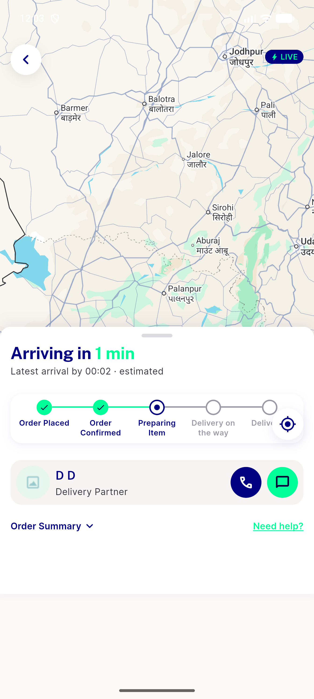

# QA Evidence — NEARS-2935

**PASS -- live Reverb round-trip verified (11 ACs demonstrated), backend+UserApp+DeliveryApp automated backstops green**

**1 screenshot(s).** Click any thumbnail for full resolution.

<table>
<tr>
<td align="center" width="33%"> ac6 7 order tracking live subscribed</td>
</tr>
</table>

### Other artifacts
- [`ac1-ac2-auth-matrix.log`](ac1-ac2-auth-matrix.log)
- [`ac10-spoof-rejected.log`](ac10-spoof-rejected.log)
- [`ac6-7-userapp-live-roundtrip.log`](ac6-7-userapp-live-roundtrip.log)
- [`ac9-deliveryhistory-db-row.log`](ac9-deliveryhistory-db-row.log)
- [`regression-app-models-user-channel-bearer-gap.log`](regression-app-models-user-channel-bearer-gap.log)
- [`regression-websocket-url-cross-app-format-mismatch.log`](regression-websocket-url-cross-app-format-mismatch.log)
- [`regression-websocket-url-formatexception.log`](regression-websocket-url-formatexception.log)

---
*From `nears/docs/qa-evidence/NEARS-2935/` · public-repo scrub policy (no live secrets; verified clean).*
