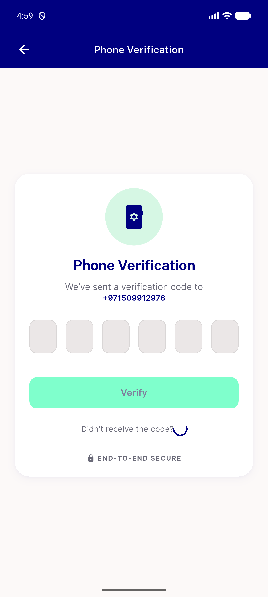
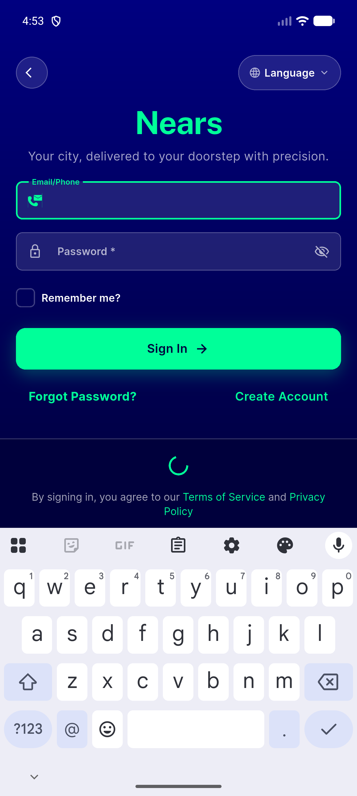
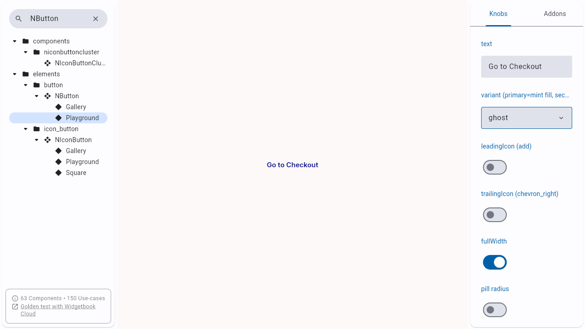
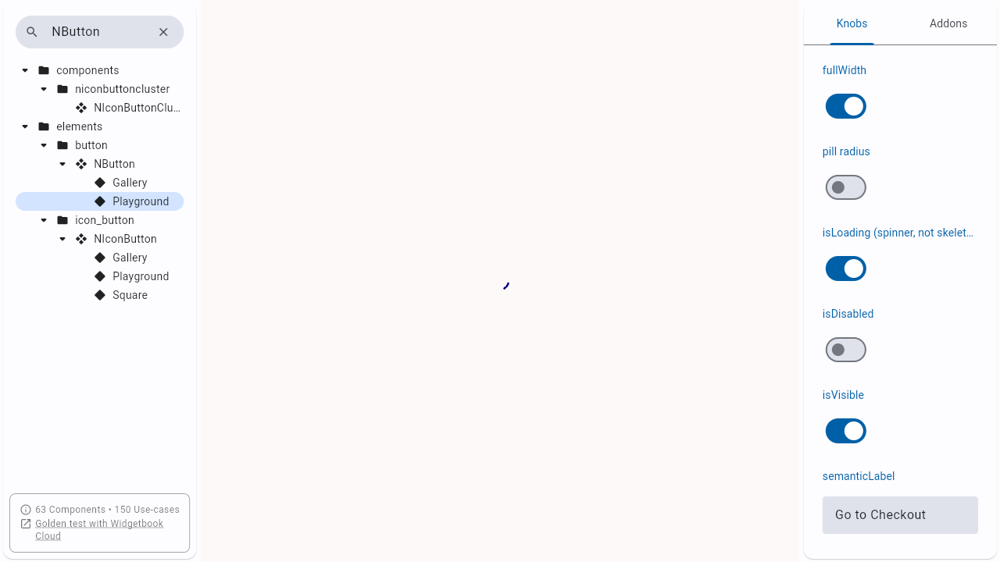

# QA Evidence — NEARS-2976

**PASS - NButton tertiary/ghost loading Semantics live-verified on emulator-5554 + widgetbook (chrome)**

**4 screenshot(s).** Click any thumbnail for full resolution.

<table>
<tr>
<td align="center" width="33%"> ac1 verification resend loading shot</td>
<td align="center" width="33%"> ac2 signin guest loading shot</td>
<td align="center" width="33%"> ac3 widgetbook ghost idle shot</td>
</tr>
<tr>
<td align="center" width="33%"> ac3 widgetbook ghost loading shot</td>
</tr>
</table>

### Other artifacts
- [`ac1-verification-resend-idle-dump.xml`](ac1-verification-resend-idle-dump.xml)
- [`ac1-verification-resend-loading-dump.xml`](ac1-verification-resend-loading-dump.xml)
- [`ac2-signin-guest-idle-dump.xml`](ac2-signin-guest-idle-dump.xml)
- [`ac3-widgetbook-ghost-semantics.txt`](ac3-widgetbook-ghost-semantics.txt)
- [`ac4-signin-guest-retry-idle-dump.xml`](ac4-signin-guest-retry-idle-dump.xml)
- [`tooling-note-uiautomator-idle-gate.txt`](tooling-note-uiautomator-idle-gate.txt)

---
*From `nears/docs/qa-evidence/NEARS-2976/` · public-repo scrub policy (no live secrets; verified clean).*
