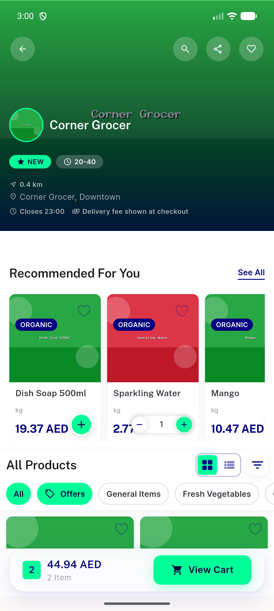
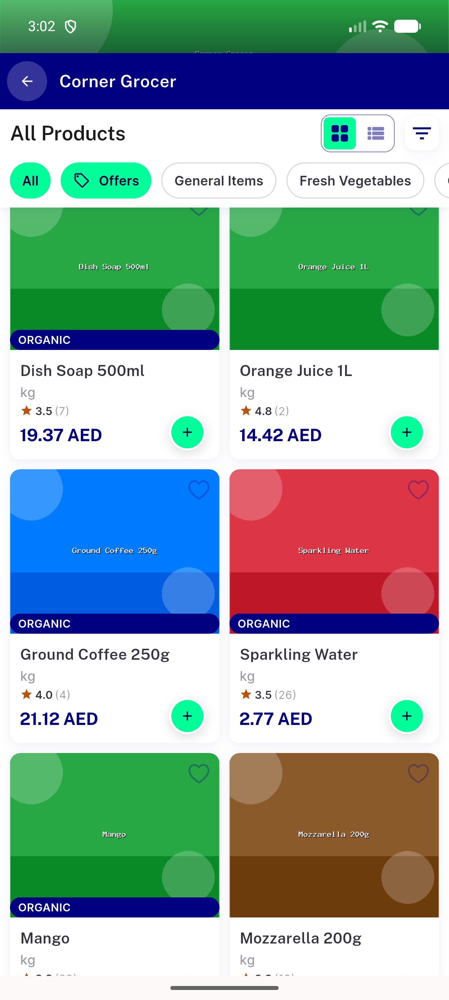
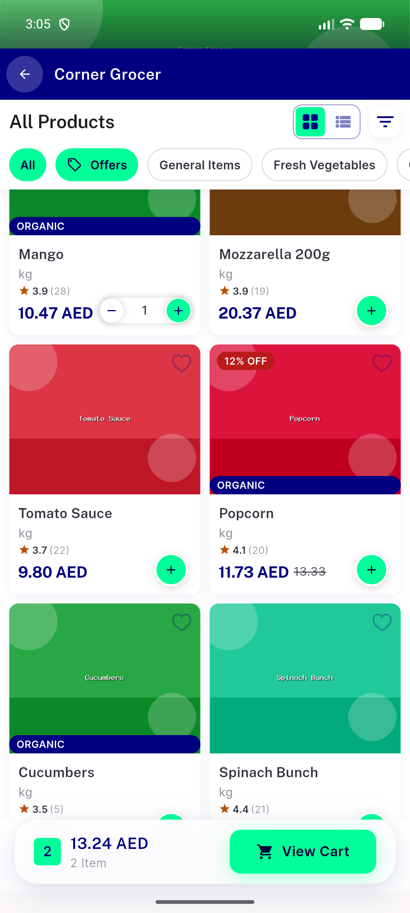

# QA Evidence — NEARS-2979

**PASS - View Cart bar reacts to optimistic cart updates (NEARS-2979)**

**4 screenshot(s).** Click any thumbnail for full resolution.

<table>
<tr>
<td align="center" width="33%"> ac1 add from recommended bar updates</td>
<td align="center" width="33%"> ac2 stepper empties to zero bar gone</td>
<td align="center" width="33%"> ac3 full reload bar renders</td>
</tr>
<tr>
<td align="center" width="33%"> ac4 cartbadge per item scoped listeners intact</td>
</tr>
</table>

---
*From `nears/docs/qa-evidence/NEARS-2979/` · public-repo scrub policy (no live secrets; verified clean).*
