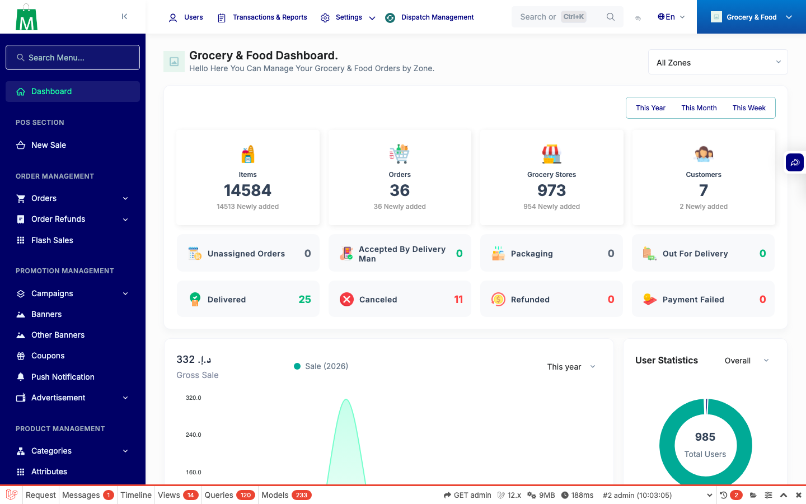
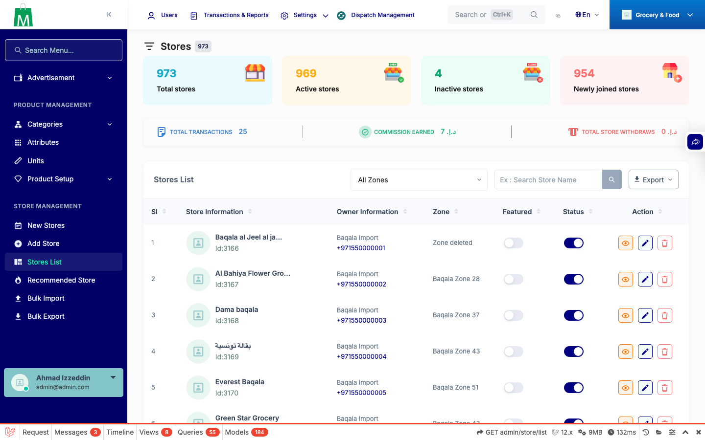
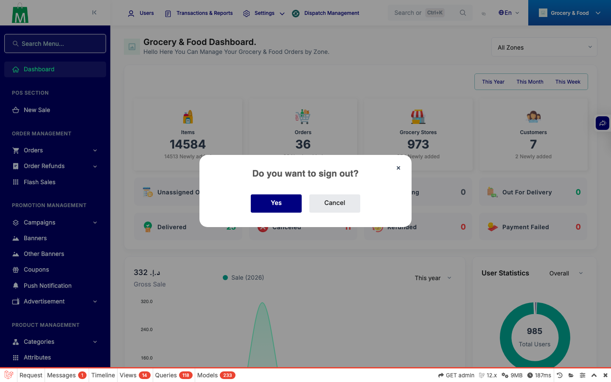
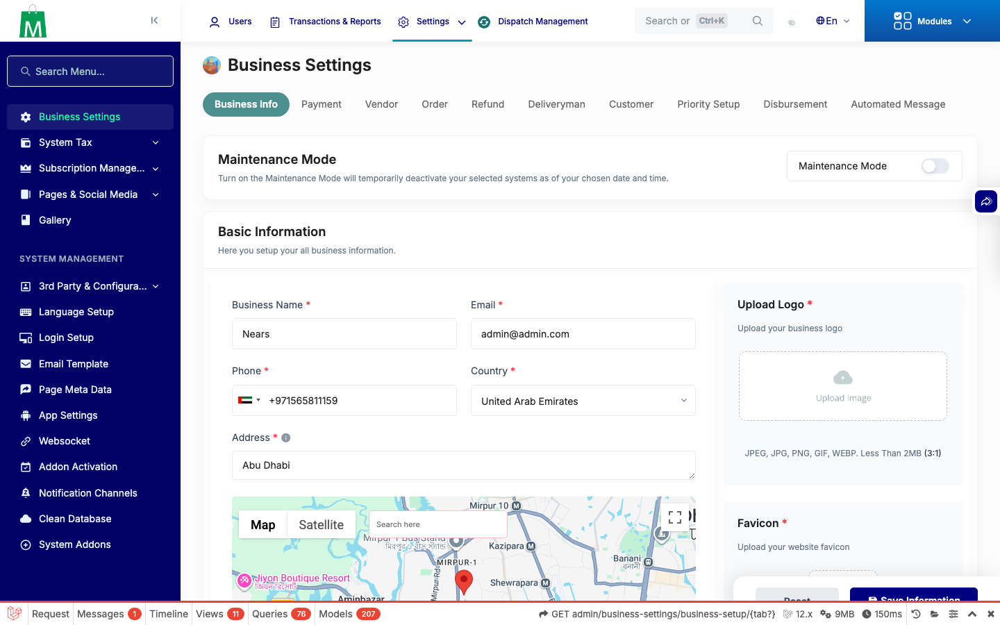
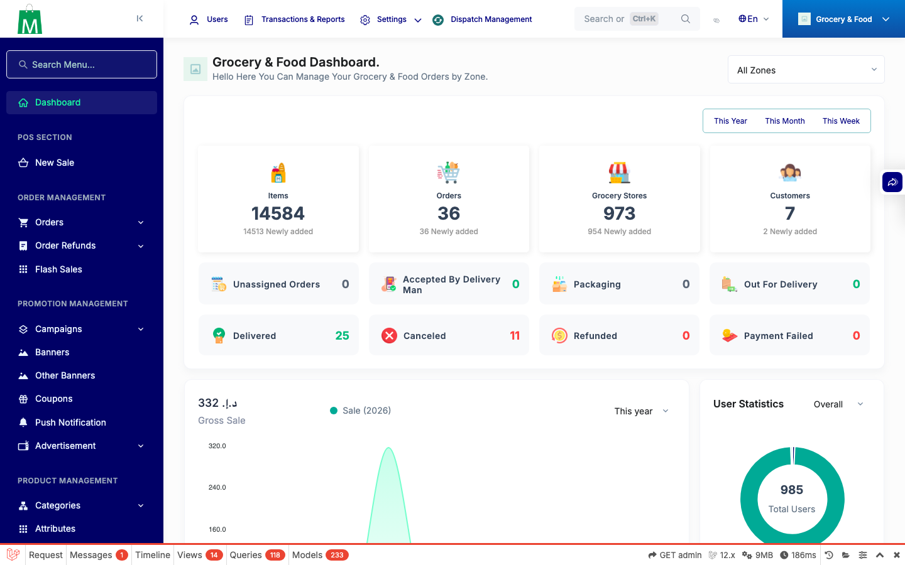
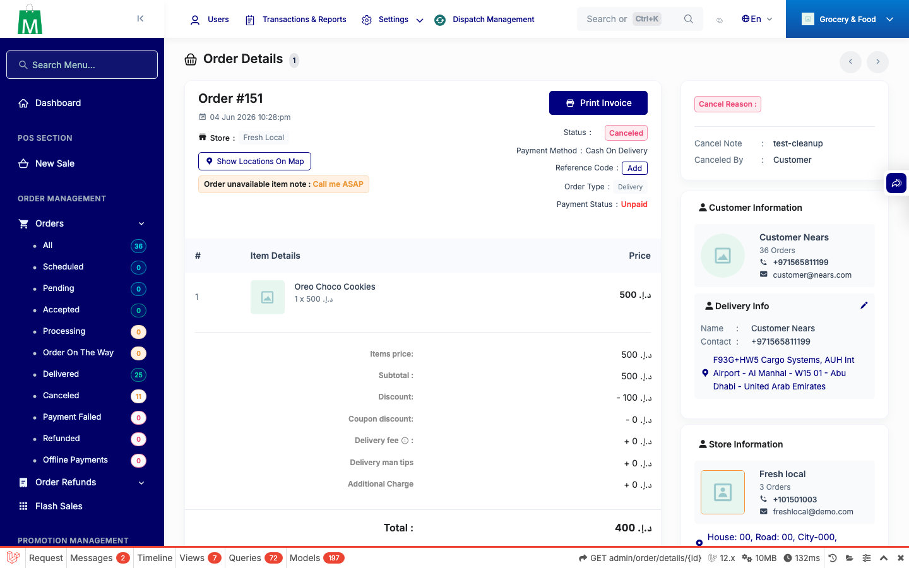
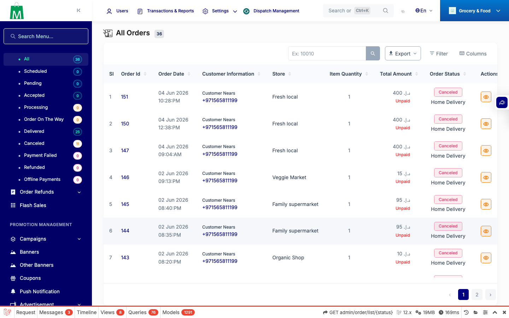

# QA Evidence — NEARS-298-301

**10 screenshot(s).** Click any thumbnail for full resolution.

<table>
<tr>
<td align="center" width="33%"> after login</td>
<td align="center" width="33%"> stores list</td>
<td align="center" width="33%"> pagination active</td>
</tr>
<tr>
<td align="center" width="33%"> pagination navy</td>
<td align="center" width="33%"> swal confirm</td>
<td align="center" width="33%"> dashboard navy</td>
</tr>
<tr>
<td align="center" width="33%"> page business settings</td>
<td align="center" width="33%"> page dashboard</td>
<td align="center" width="33%"> page order detail</td>
</tr>
<tr>
<td align="center" width="33%"> page order list</td>
</tr>
</table>

### Other artifacts
- [`console-log.txt`](console-log.txt)

---
*From `nears/docs/qa-evidence/NEARS-298-301/` · public-repo scrub policy (no live secrets; verified clean).*
