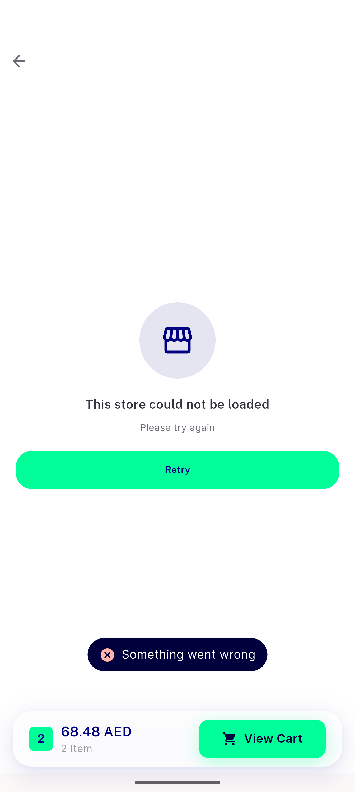

# QA Evidence — NEARS-2995

**PASS — NEARS-2995 store-scroll-rebuild QA, emulator-5558, 2026-09-08**

**6 screenshot(s).** Click any thumbnail for full resolution.

<table>
<tr>
<td align="center" width="33%"> ac a fab visible on load</td>
<td align="center" width="33%"> ac b grid page3 pagination end</td>
<td align="center" width="33%"> ac c empty catalog state</td>
</tr>
<tr>
<td align="center" width="33%"> ac c grid page1 2col</td>
<td align="center" width="33%"> ac c store fetch error retry</td>
<td align="center" width="33%"> bug fab stretched height regression</td>
</tr>
</table>

### Other artifacts
- [`bug-fab-stretched-height-a11y-dump.xml`](bug-fab-stretched-height-a11y-dump.xml)
- [`bug-get-position-timeout.log`](bug-get-position-timeout.log)

---
*From `nears/docs/qa-evidence/NEARS-2995/` · public-repo scrub policy (no live secrets; verified clean).*
