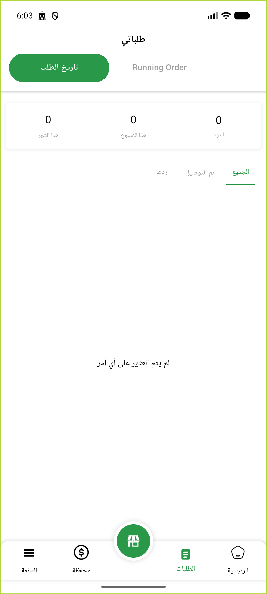
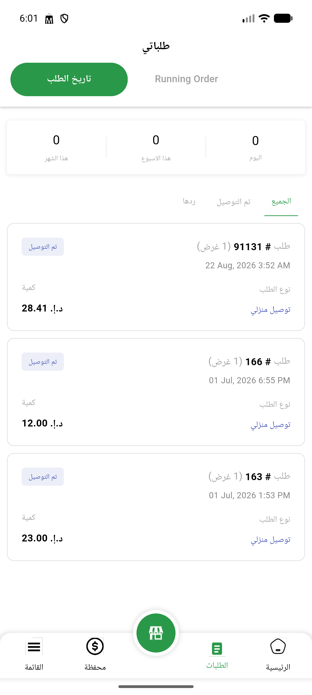
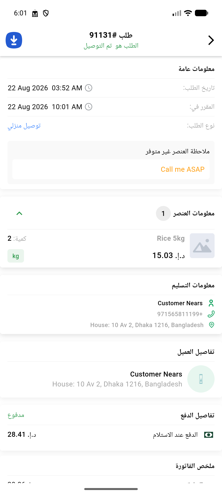

# QA Evidence — NEARS-2999

**PASS -- vendor order-list N+1 fix: 91/87 queries (25/order), byte-identical response, zero-order edge case clean**

**3 screenshot(s).** Click any thumbnail for full resolution.

<table>
<tr>
<td align="center" width="33%"> ac edge zero orders</td>
<td align="center" width="33%"> ac2 completed orders history</td>
<td align="center" width="33%"> ac2 order details 91131</td>
</tr>
</table>

---
*From `nears/docs/qa-evidence/NEARS-2999/` · public-repo scrub policy (no live secrets; verified clean).*
