# QA Evidence — NEARS-3002

**PASS — UserApp orphaned-assets sweep: APK size confirmed 27,572,499 bytes/115 assets, guard test RED/GREEN proven, full-app smoke clean, no broken images**

**17 screenshot(s).** Click any thumbnail for full resolution.

<table>
<tr>
<td align="center" width="33%"><a href="ac3-cancelled-order-gif.png">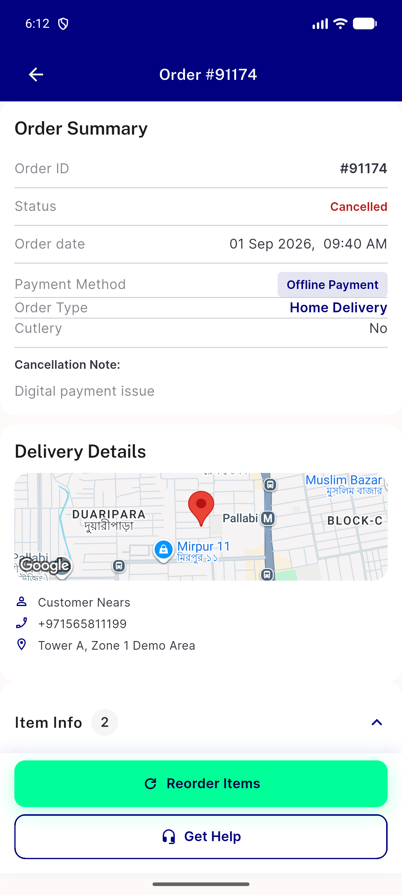</a> ac3 cancelled order gif</td>
<td align="center" width="33%"><a href="ac3-categories.png">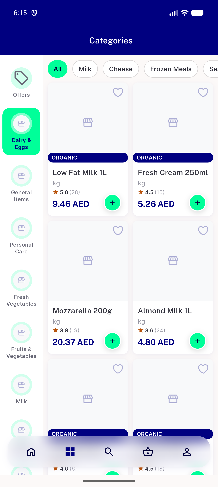</a> ac3 categories</td>
<td align="center" width="33%"><a href="ac3-grocery-home.png">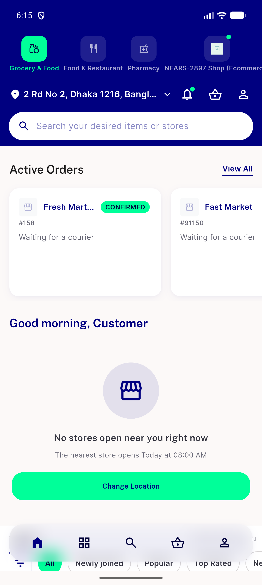</a> ac3 grocery home</td>
</tr>
<tr>
<td align="center" width="33%"> ac3 home active orders</td>
<td align="center" width="33%"> ac3 module picker</td>
<td align="center" width="33%"><a href="ac3-order-details-gif.png">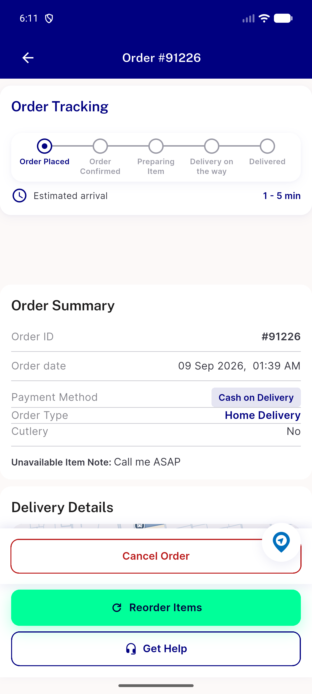</a> ac3 order details gif</td>
</tr>
<tr>
<td align="center" width="33%"><a href="ac3-order-tracking.png">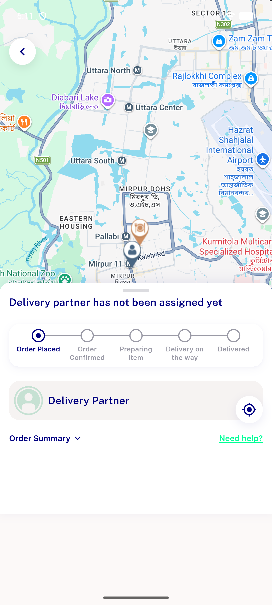</a> ac3 order tracking</td>
<td align="center" width="33%"><a href="ac3-support.png">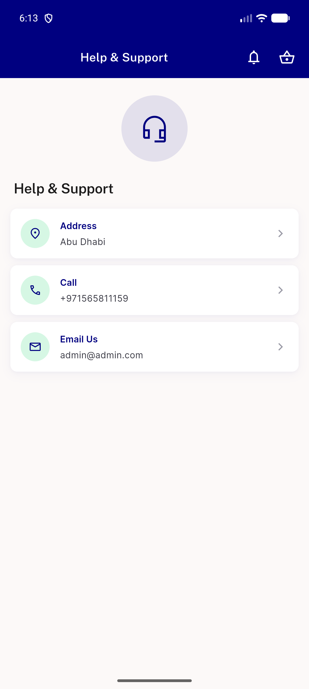</a> ac3 support</td>
<td align="center" width="33%"><a href="ac4-auth-dialog-logo.png">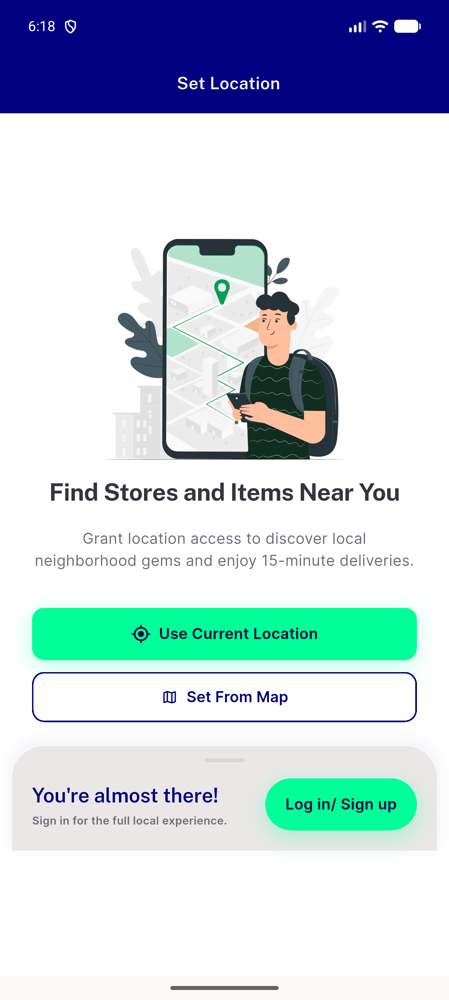</a> ac4 auth dialog logo</td>
</tr>
<tr>
<td align="center" width="33%"> ac4 auth dialog2</td>
<td align="center" width="33%"><a href="ac4-signin-logo.png">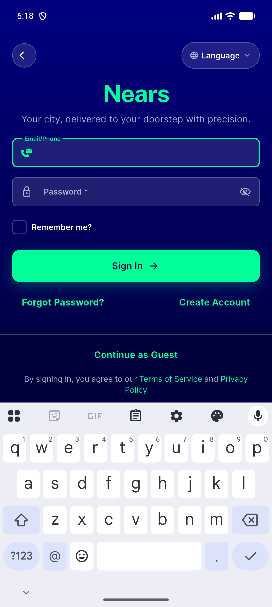</a> ac4 signin logo</td>
<td align="center" width="33%"><a href="ac4-splash-logo.png">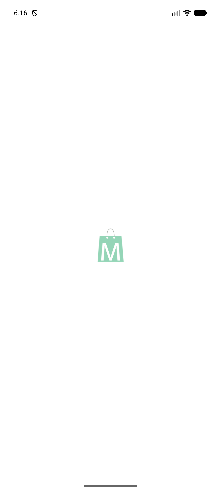</a> ac4 splash logo</td>
</tr>
<tr>
<td align="center" width="33%"><a href="ac4-splash-logo2.png">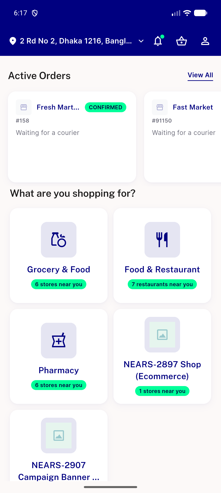</a> ac4 splash logo2</td>
<td align="center" width="33%"><a href="ac4-splash-try2.png">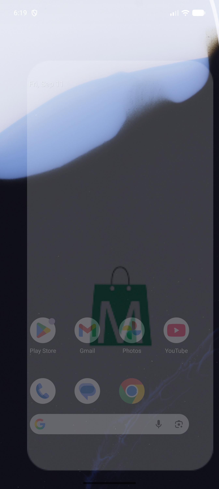</a> ac4 splash try2</td>
<td align="center" width="33%"><a href="ac5-coupons.png">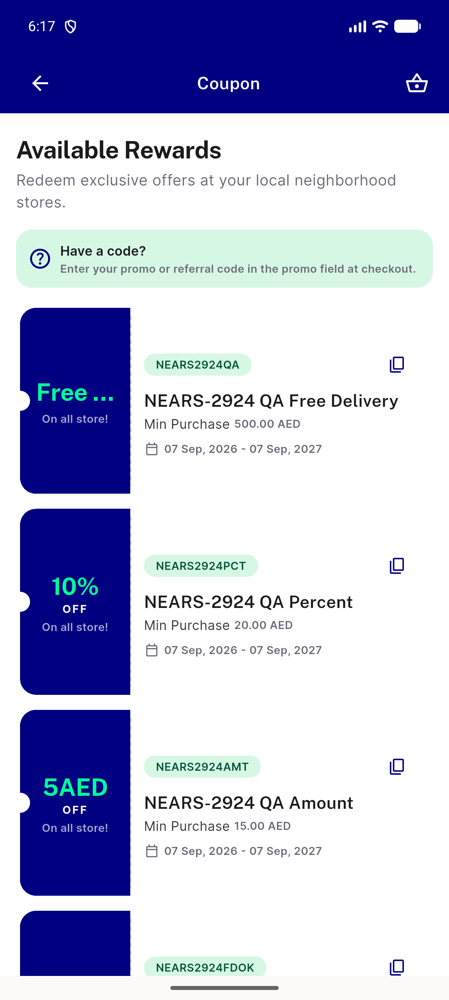</a> ac5 coupons</td>
</tr>
<tr>
<td align="center" width="33%"><a href="ac5-profile-edit.png">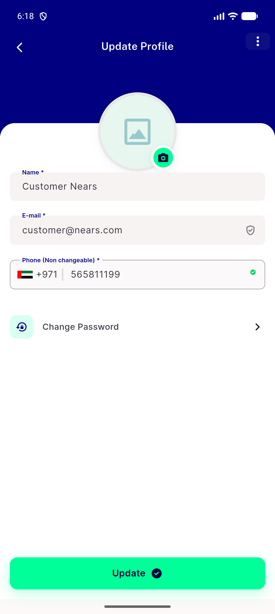</a> ac5 profile edit</td>
<td align="center" width="33%"><a href="ac5-wallet.png">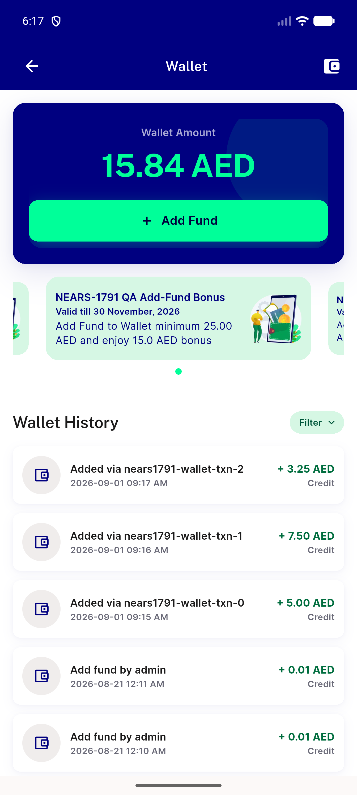</a> ac5 wallet</td>
</tr>
</table>

---
*From `nears/docs/qa-evidence/NEARS-3002/` · public-repo scrub policy (no live secrets; verified clean).*
