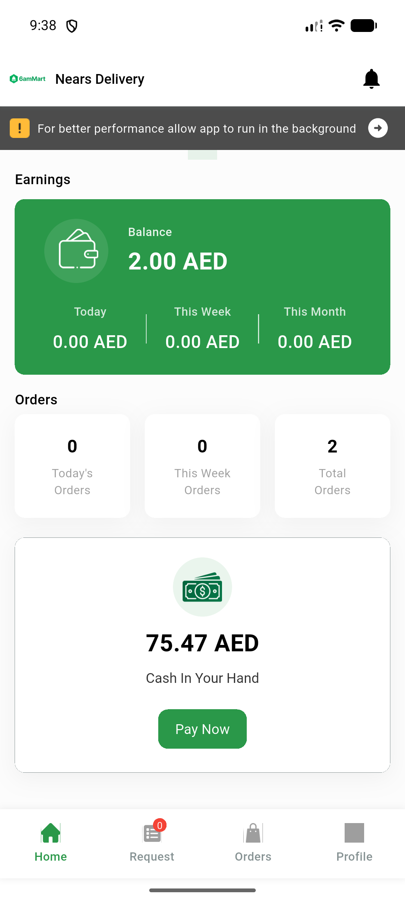
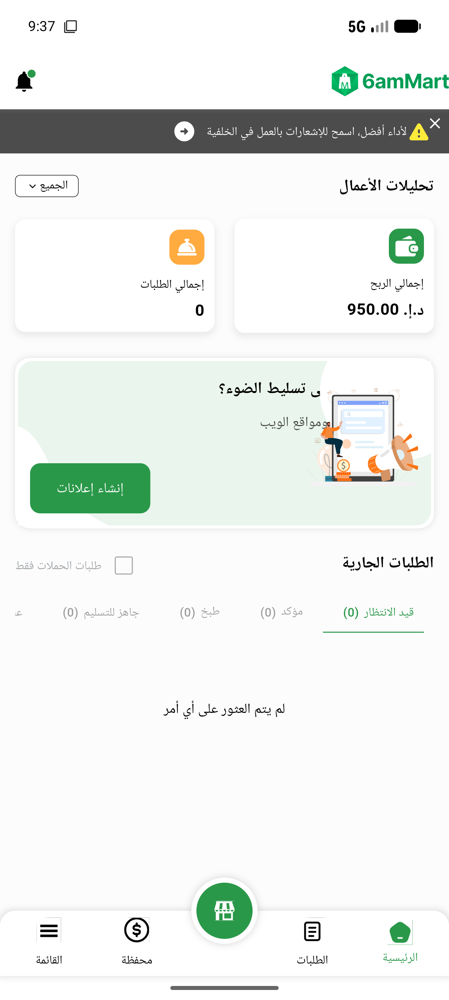

# QA Evidence — NEARS-3004

**PASS — splash Timer budget cap verified live on DeliveryApp + VendorApp**

**2 screenshot(s).** Click any thumbnail for full resolution.

<table>
<tr>
<td align="center" width="33%"> deliveryapp dashboard</td>
<td align="center" width="33%"> vendorapp dashboard</td>
</tr>
</table>

### Other artifacts
- [`ac1-deliveryapp-timing.log`](ac1-deliveryapp-timing.log)
- [`ac1-vendorapp-timing.log`](ac1-vendorapp-timing.log)
- [`ac3-ac4-deliveryapp-retry-reconnect.log`](ac3-ac4-deliveryapp-retry-reconnect.log)
- [`ac3-ac4-vendorapp-retry-reconnect.log`](ac3-ac4-vendorapp-retry-reconnect.log)
- [`regression-deliveryapp-logout-401-loop.log`](regression-deliveryapp-logout-401-loop.log)

---
*From `nears/docs/qa-evidence/NEARS-3004/` · public-repo scrub policy (no live secrets; verified clean).*
