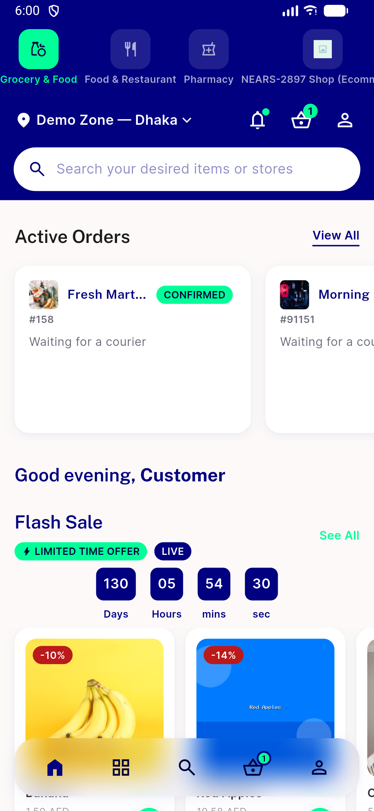

# QA Evidence — NEARS-3007

**fix-cycle 2 PASS: AC1 ecommerce-module Brands see-all -> BrandsScreen live tap-through; AC2 exactly 1 brands row module_id=9; AC3 grocery module home renders cleanly, no Brands section, no stale module_id=1 reference**

**3 screenshot(s).** Click any thumbnail for full resolution.

<table>
<tr>
<td align="center" width="33%"> ac1 cycle2 brands screen</td>
<td align="center" width="33%"> ac1 cycle2 ecommerce home brands section</td>
<td align="center" width="33%"> ac3 cycle2 grocery home no brands</td>
</tr>
</table>

---
*From `nears/docs/qa-evidence/NEARS-3007/` · public-repo scrub policy (no live secrets; verified clean).*
