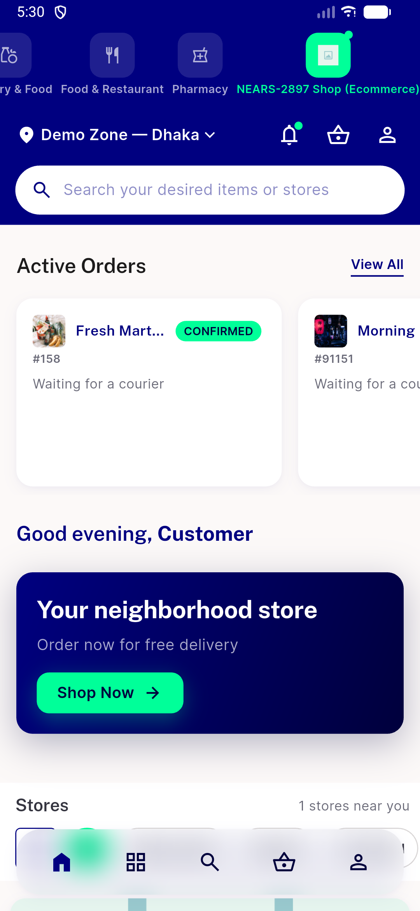
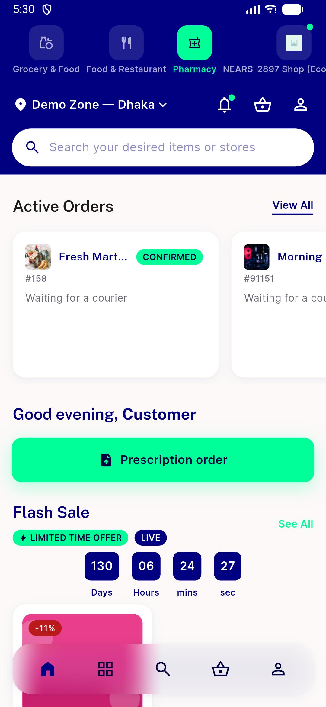
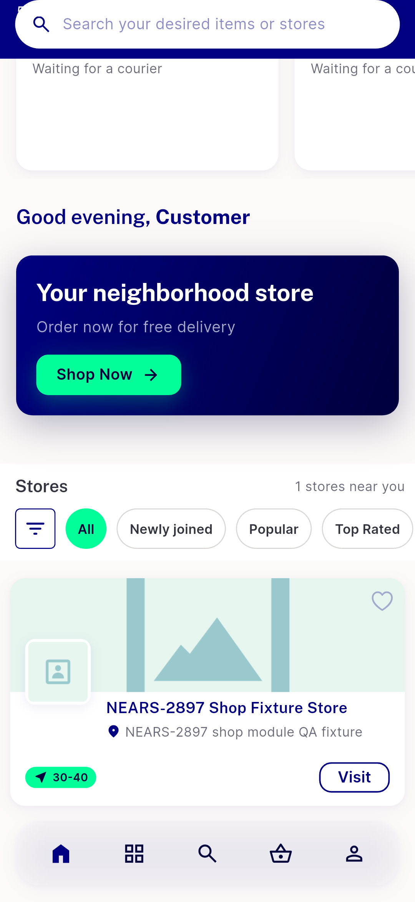

# QA Evidence — NEARS-3007

**FAIL - AC1 unreachable (brands carousel/module mismatch), AC2 PASS idempotent, AC3 PASS regression clean**

**3 screenshot(s).** Click any thumbnail for full resolution.

<table>
<tr>
<td align="center" width="33%"> ac3 ecommerce module home clean no brands</td>
<td align="center" width="33%"> ac3 pharmacy module home clean no brands</td>
<td align="center" width="33%"> bug brands carousel unreachable shop home scrolled</td>
</tr>
</table>

### Other artifacts
- [`ac2-idempotent-reseed.log`](ac2-idempotent-reseed.log)
- [`bug-brands-carousel-unreachable.log`](bug-brands-carousel-unreachable.log)

---
*From `nears/docs/qa-evidence/NEARS-3007/` · public-repo scrub policy (no live secrets; verified clean).*
