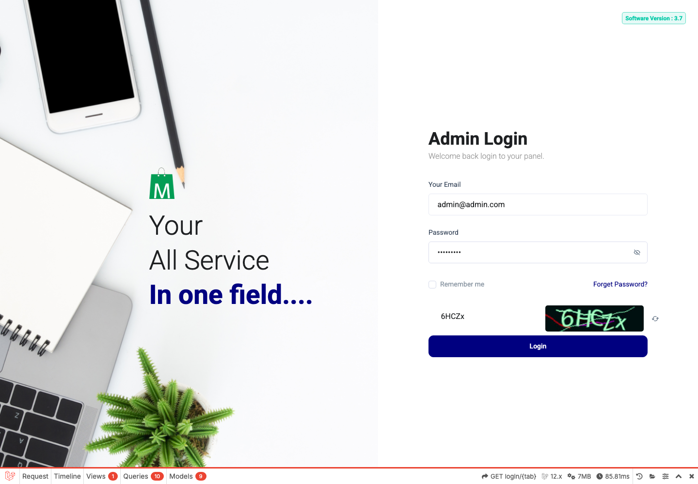
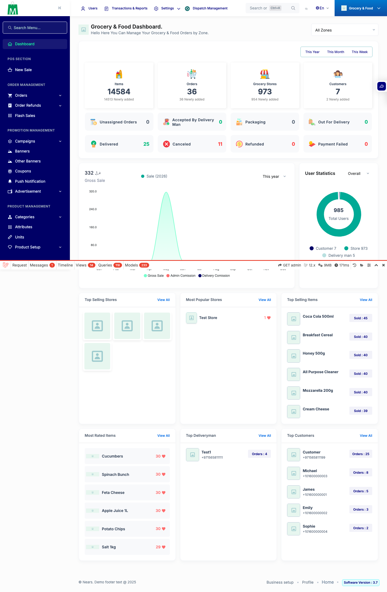
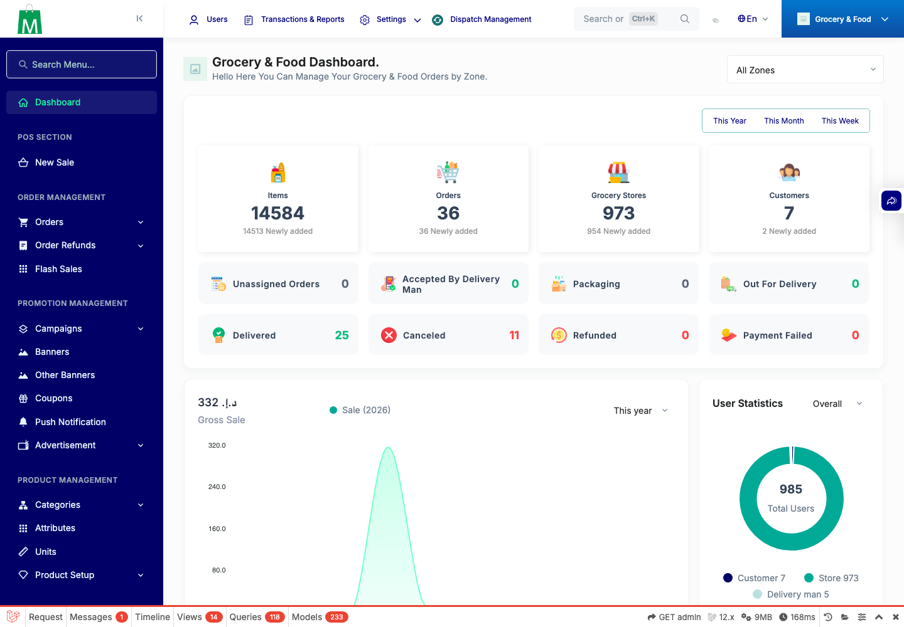
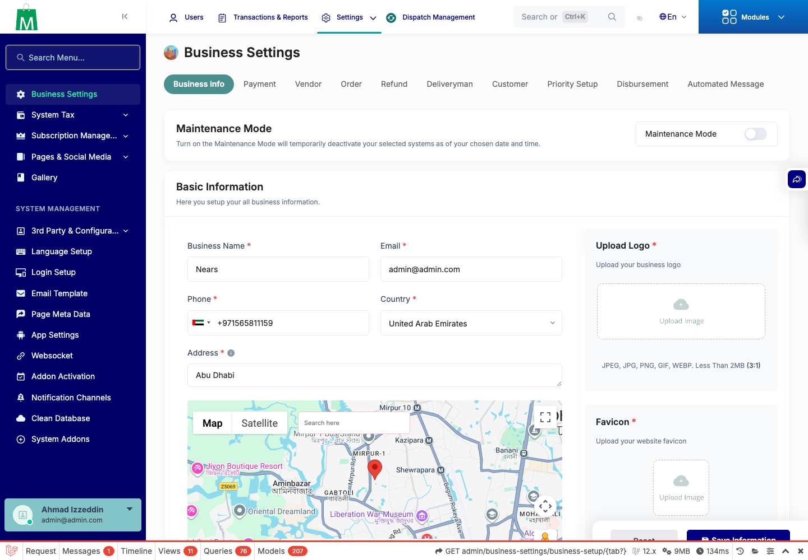
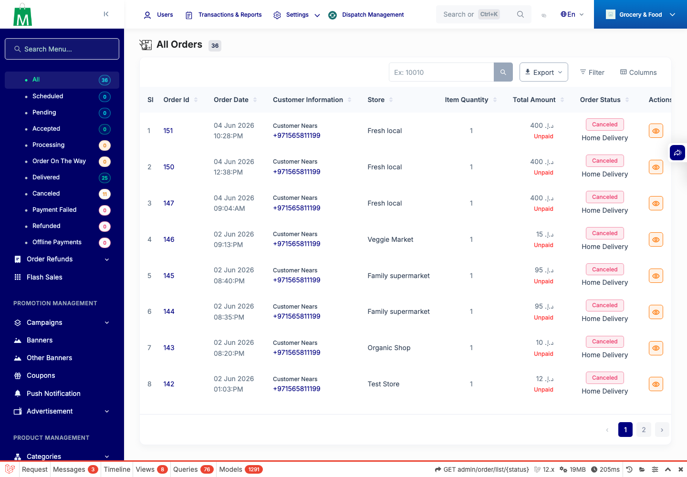
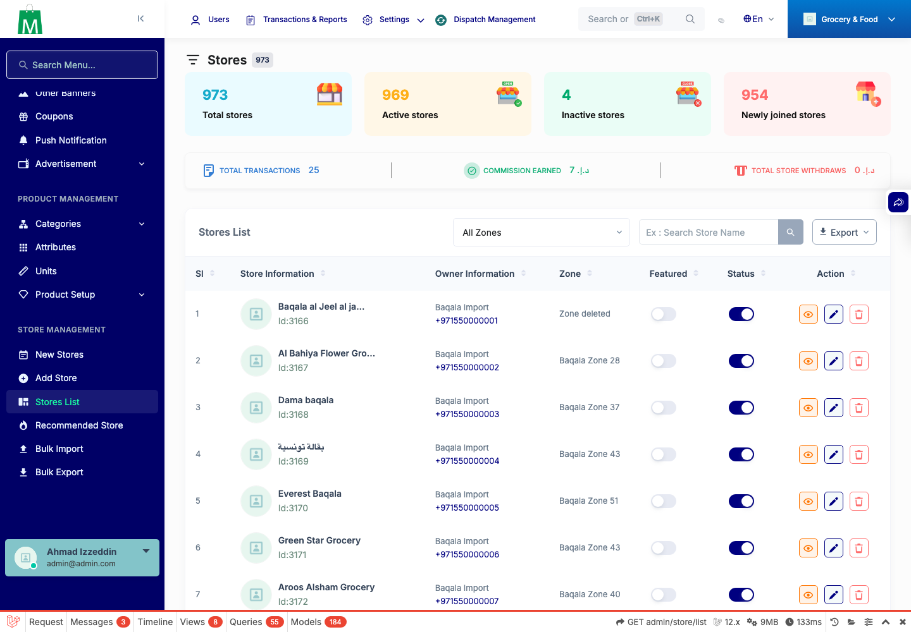
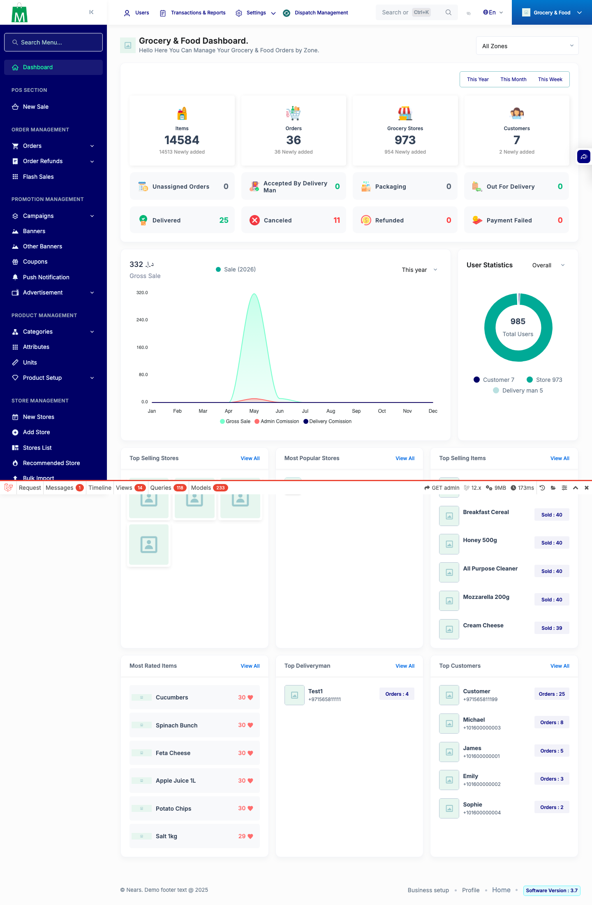

# QA Evidence — NEARS-302

**9 screenshot(s).** Click any thumbnail for full resolution.

<table>
<tr>
<td align="center" width="33%"> login</td>
<td align="center" width="33%"> dashboard clean</td>
<td align="center" width="33%"> dashboard</td>
</tr>
<tr>
<td align="center" width="33%"> dash food</td>
<td align="center" width="33%"> dash grocery</td>
<td align="center" width="33%"> reg businessSettings</td>
</tr>
<tr>
<td align="center" width="33%"> reg orders</td>
<td align="center" width="33%"> reg storesList</td>
<td align="center" width="33%"> module dashboard</td>
</tr>
</table>

### Other artifacts
- [`QA-SUMMARY.txt`](QA-SUMMARY.txt)
- [`all-console-msgs.json`](all-console-msgs.json)
- [`console-capture.json`](console-capture.json)
- [`dashboard-only-capture.json`](dashboard-only-capture.json)
- [`module-options.json`](module-options.json)

---
*From `nears/docs/qa-evidence/NEARS-302/` · public-repo scrub policy (no live secrets; verified clean).*
