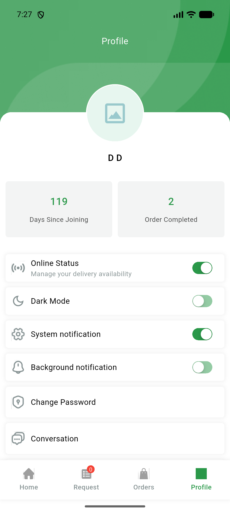
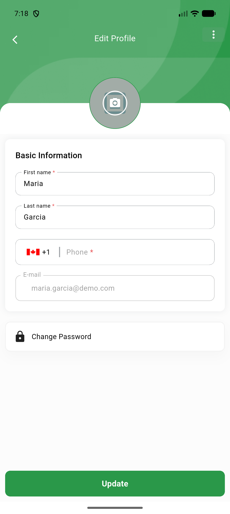

# QA Evidence — NEARS-3025

**QA FAIL (VendorApp login double profile-fetch AC2) / DeliveryApp AC1,3,5,6,7 PASS**

**2 screenshot(s).** Click any thumbnail for full resolution.

<table>
<tr>
<td align="center" width="33%"> deliveryapp warmlogin dd profile ac7</td>
<td align="center" width="33%"> vendorapp home ac3 warmlogin maria</td>
</tr>
</table>

### Other artifacts
- [`bug-vendorapp-login-double-profile-fetch.log`](bug-vendorapp-login-double-profile-fetch.log)

---
*From `nears/docs/qa-evidence/NEARS-3025/` · public-repo scrub policy (no live secrets; verified clean).*
