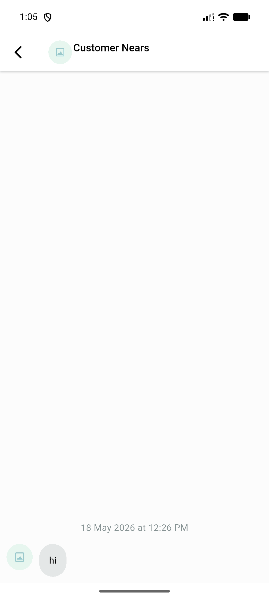
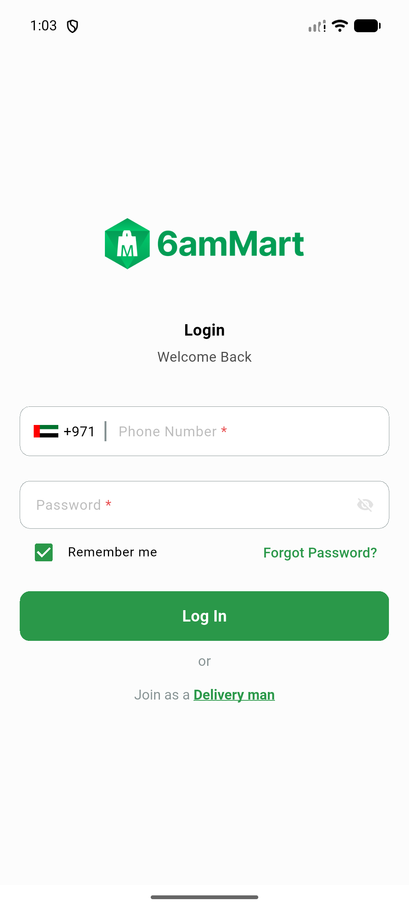
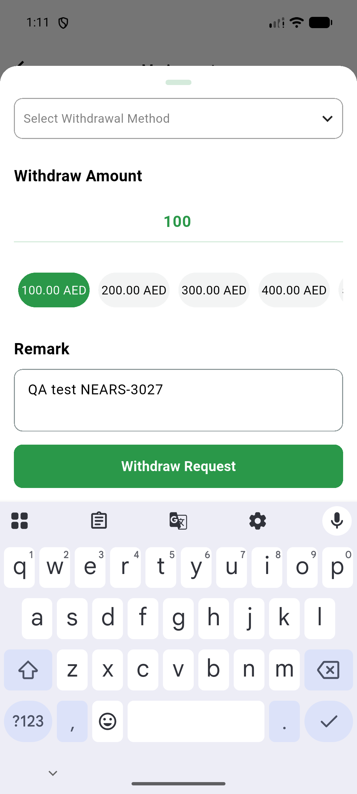

# QA Evidence — NEARS-3027

**PASS — 7/7 ACs demonstrated, 14 files dispose/onClose confirmed 0 undisposed, flutter analyze clean, 434 flutter tests pass, live cycling on 8 screens with 0 dispose exceptions**

**5 screenshot(s).** Click any thumbnail for full resolution.

<table>
<tr>
<td align="center" width="33%"> ac5 chat screen</td>
<td align="center" width="33%"> ac5 signin screen</td>
<td align="center" width="33%"> ac5 withdraw bottomsheet</td>
</tr>
<tr>
<td align="center" width="33%"> ac5 withdraw submit toast</td>
<td align="center" width="33%"> bug chat input row not rendered</td>
</tr>
</table>

### Other artifacts
- [`chat-input-row-absent-dump.xml`](chat-input-row-absent-dump.xml)

---
*From `nears/docs/qa-evidence/NEARS-3027/` · public-repo scrub policy (no live secrets; verified clean).*
