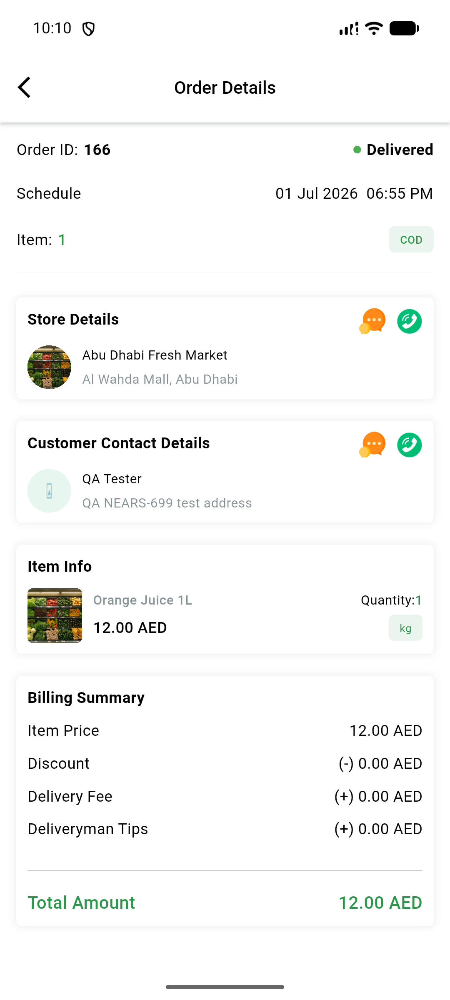
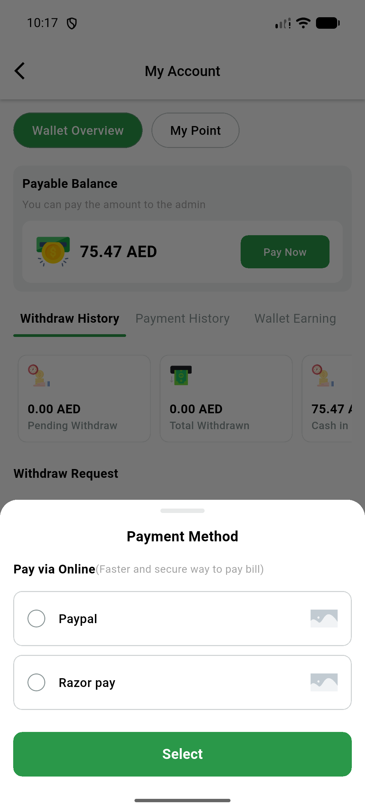
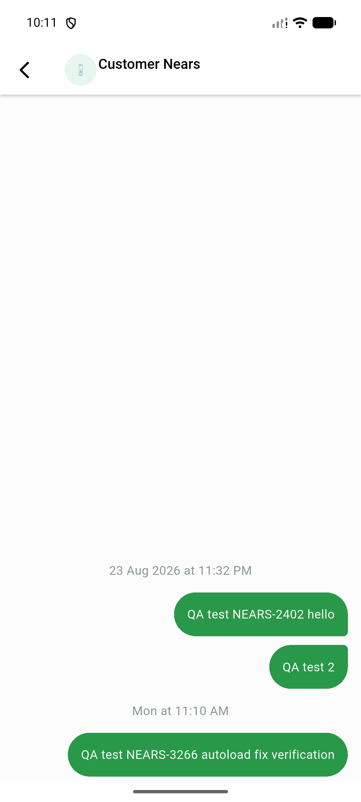
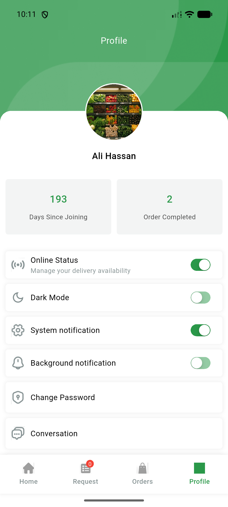
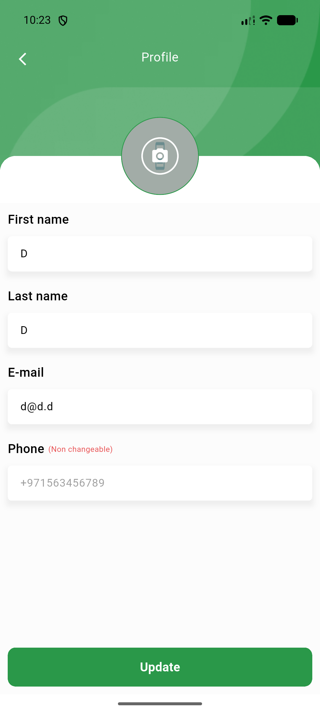

# QA Evidence — NEARS-3029

**PASS with 1 documented unverifiable sub-item — DeliveryApp CustomImageWidget memCache decode-bounds port, no blur/stretch/crash regression observed on any reachable call site**

**5 screenshot(s).** Click any thumbnail for full resolution.

<table>
<tr>
<td align="center" width="33%"> ac2 order details item store thumbnails</td>
<td align="center" width="33%"> ac3 payment method bottomsheet width omitted</td>
<td align="center" width="33%"> ac4 chat header avatar</td>
</tr>
<tr>
<td align="center" width="33%"> ac4 profile avatar</td>
<td align="center" width="33%"> ac4 update profile avatar placeholder</td>
</tr>
</table>

---
*From `nears/docs/qa-evidence/NEARS-3029/` · public-repo scrub policy (no live secrets; verified clean).*
