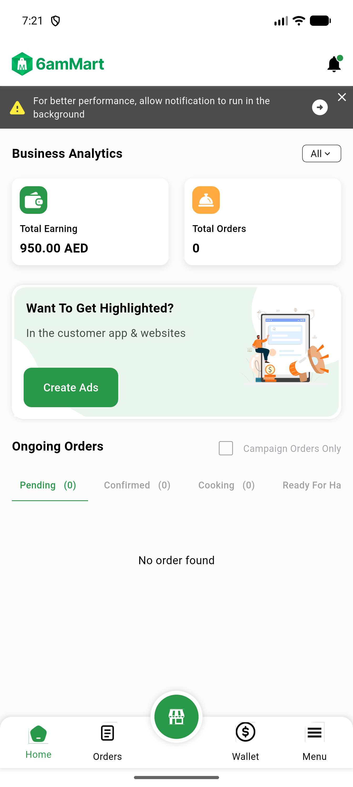

# QA Evidence — NEARS-3030

**QA PASS static AC1-4 + live AC6; AC5 UNVERIFIABLE (no reachable dispose-race trigger)**

**1 screenshot(s).** Click any thumbnail for full resolution.

<table>
<tr>
<td align="center" width="33%"> vendorapp coldstart dashboard ac6</td>
</tr>
</table>

---
*From `nears/docs/qa-evidence/NEARS-3030/` · public-repo scrub policy (no live secrets; verified clean).*
