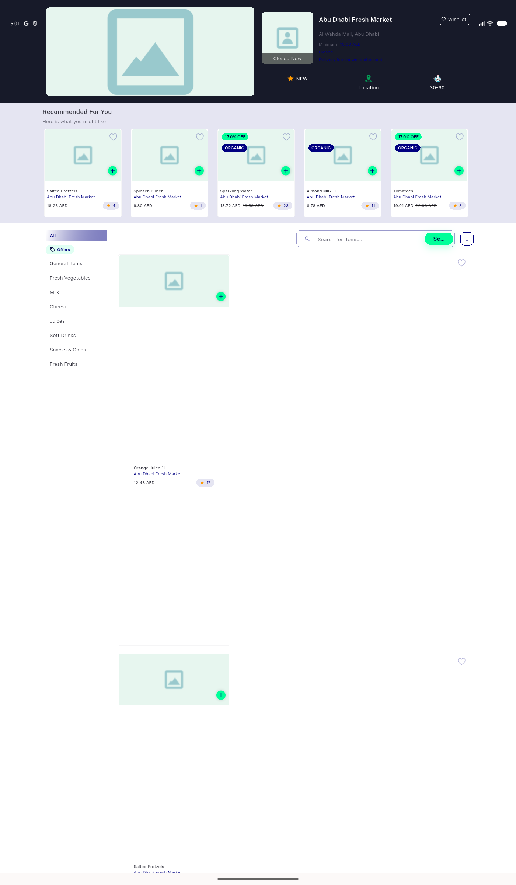

# QA Evidence — NEARS-3039

**delta re-QA cycle1: PASS — excludeFromSemantics fix verified, Location node now android.view.View (button-shaped)**

**1 screenshot(s).** Click any thumbnail for full resolution.

<table>
<tr>
<td align="center" width="33%"> ac1 desktop location node</td>
</tr>
</table>

### Other artifacts
- [`ac1-desktop-location-node-cycle1.xml`](ac1-desktop-location-node-cycle1.xml)
- [`store-detail-desktop-viewport-dump.xml`](store-detail-desktop-viewport-dump.xml)

---
*From `nears/docs/qa-evidence/NEARS-3039/` · public-repo scrub policy (no live secrets; verified clean).*
