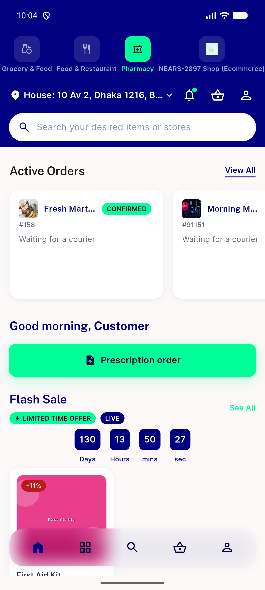

# QA Evidence — NEARS-3041

**PASS — layering fix verified live on emulator-5556 (sha f73a0846a): seed-once + persist round-trip through SplashService→SplashRepository, key unchanged**

**3 screenshot(s).** Click any thumbnail for full resolution.

<table>
<tr>
<td align="center" width="33%"> ac5 home module row fresh install</td>
<td align="center" width="33%"> ac5 module row crop</td>
<td align="center" width="33%"> ac6 module row after tap shop then pharmacy</td>
</tr>
</table>

### Other artifacts
- [`ac5-home-a11y-dump.xml`](ac5-home-a11y-dump.xml)
- [`ac7-boot-logcat-pid10243.log`](ac7-boot-logcat-pid10243.log)
- [`bug-new-dot-on-zone-only-module-after-pre-zone-baseline.log`](bug-new-dot-on-zone-only-module-after-pre-zone-baseline.log)
- [`progress.md`](progress.md)

---
*From `nears/docs/qa-evidence/NEARS-3041/` · public-repo scrub policy (no live secrets; verified clean).*
