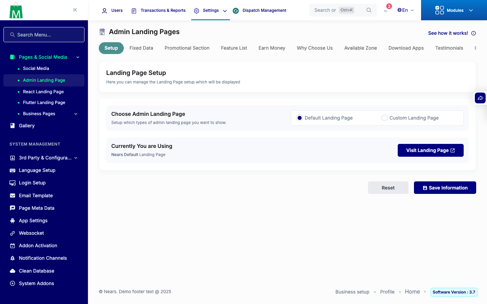
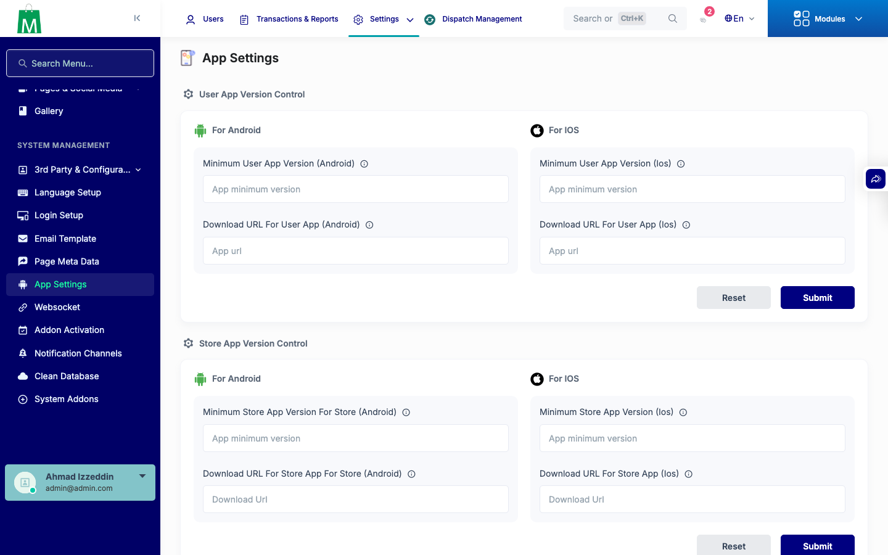
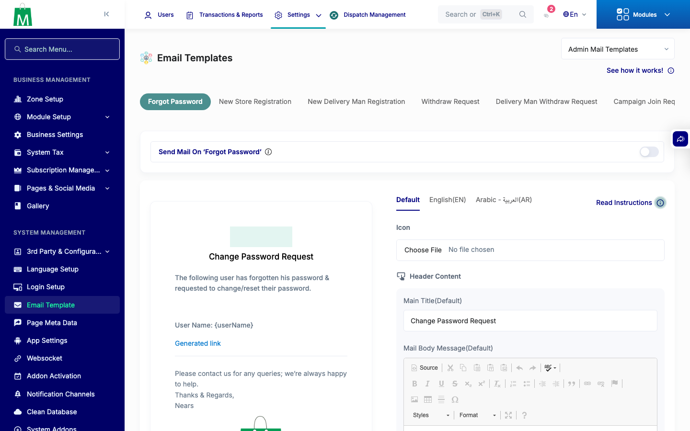
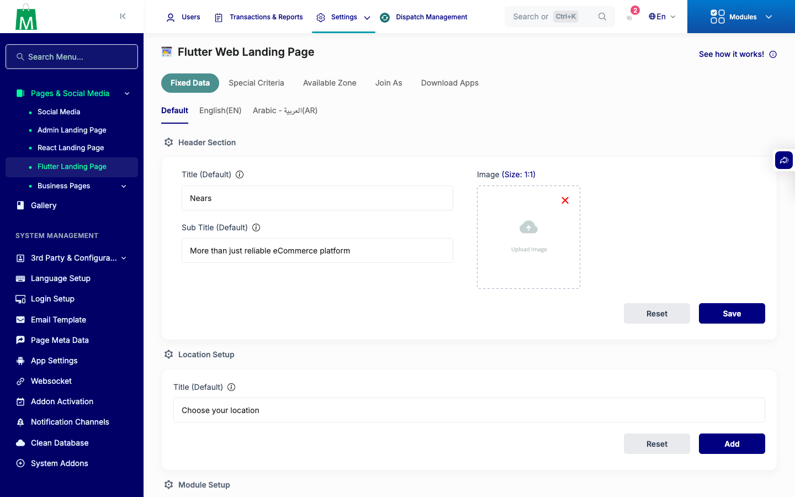
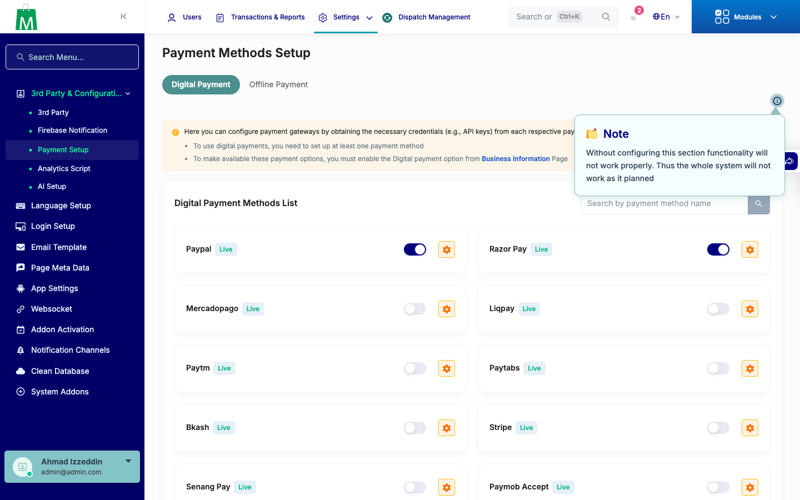
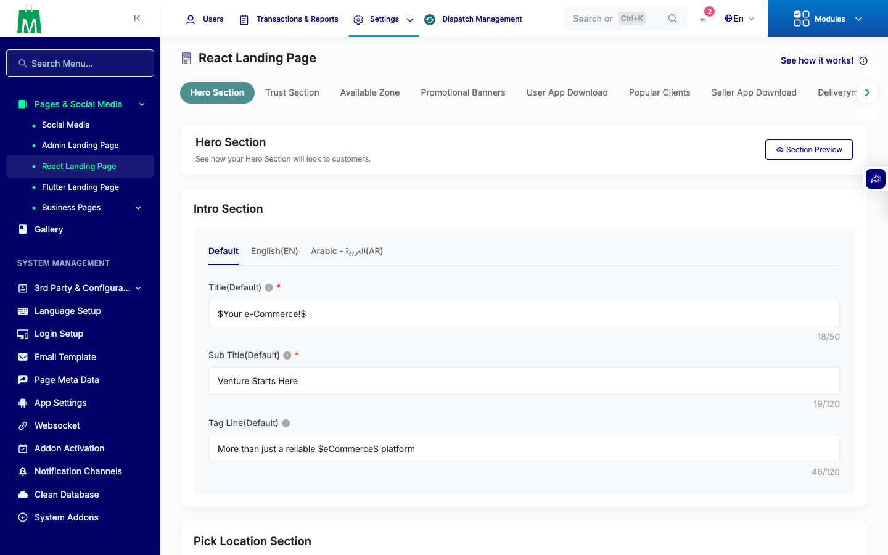

# QA Evidence — NEARS-3047

**PASS — 6/6 AC live-verified, 1655/1656 phpunit green (pre-existing NEARS-2019), AC6 8/8, live admin panel smoke clean; 1 pre-existing unrelated regression logged**

**6 screenshot(s).** Click any thumbnail for full resolution.

<table>
<tr>
<td align="center" width="33%"> smoke admin landing setup</td>
<td align="center" width="33%"> smoke app settings</td>
<td align="center" width="33%"> smoke email setup</td>
</tr>
<tr>
<td align="center" width="33%"> smoke flutter landing fixed</td>
<td align="center" width="33%"> smoke payment method</td>
<td align="center" width="33%"> smoke react landing header</td>
</tr>
</table>

### Other artifacts
- [`bug-admin-landing-page-settings-no-tab-arg-count-error.log`](bug-admin-landing-page-settings-no-tab-arg-count-error.log)

---
*From `nears/docs/qa-evidence/NEARS-3047/` · public-repo scrub policy (no live secrets; verified clean).*
