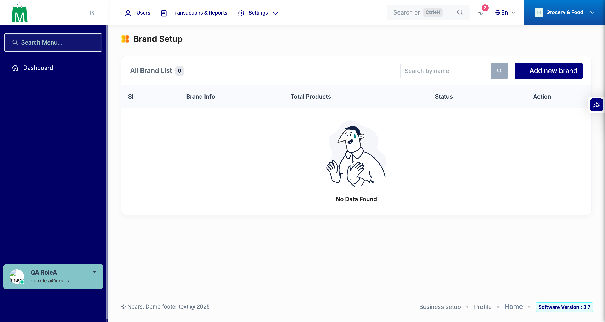
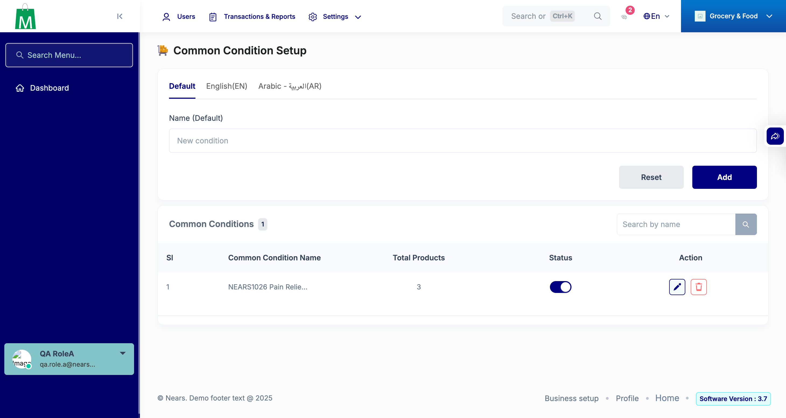
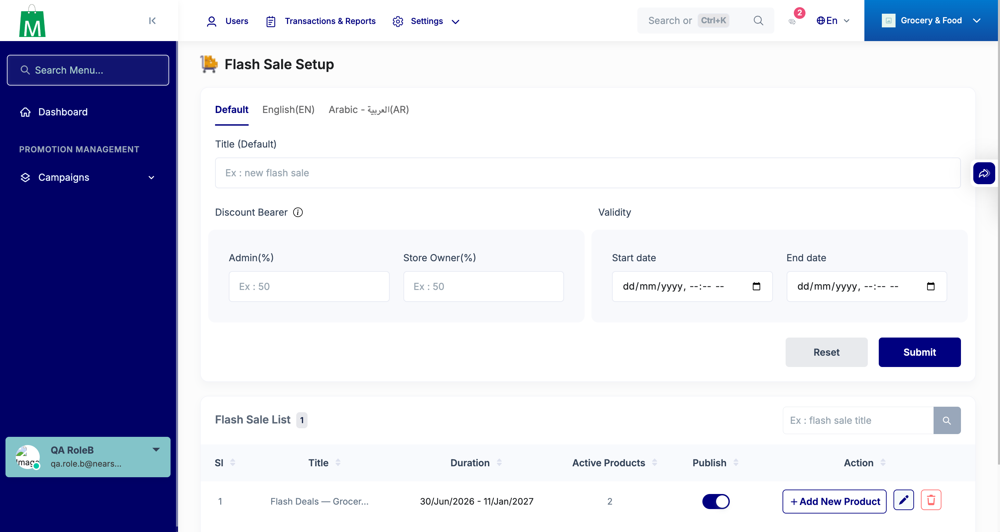
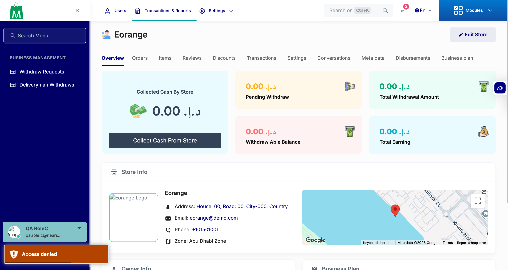
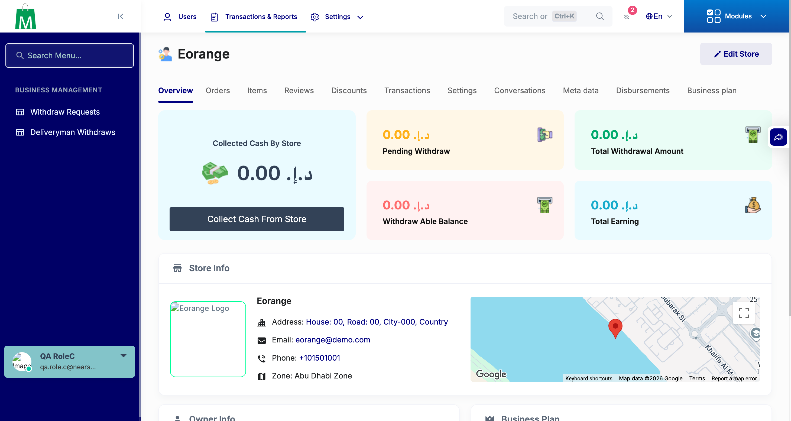
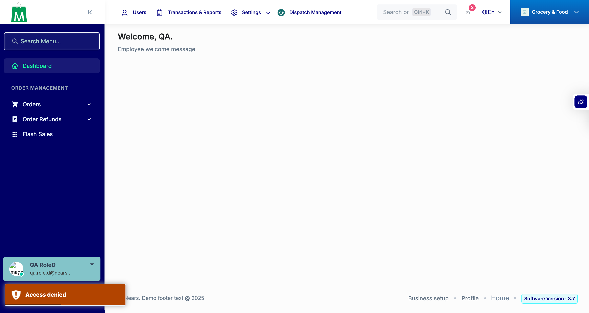

# QA Evidence — NEARS-3057

**PASS - all 6 ACs demonstrated live, both directions, phpunit ratchet tests green**

**6 screenshot(s).** Click any thumbnail for full resolution.

<table>
<tr>
<td align="center" width="33%"> rolea brand allowed</td>
<td align="center" width="33%"> rolea common condition allowed</td>
<td align="center" width="33%"> roleb flashsale allowed</td>
</tr>
<tr>
<td align="center" width="33%"> rolec coupon denied regression sanity</td>
<td align="center" width="33%"> rolec transactions view allowed</td>
<td align="center" width="33%"> roled brand denied</td>
</tr>
</table>

---
*From `nears/docs/qa-evidence/NEARS-3057/` · public-repo scrub policy (no live secrets; verified clean).*
