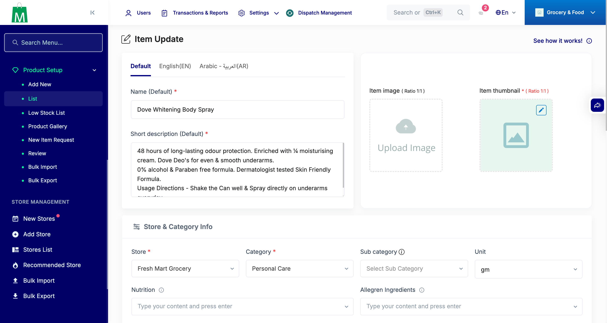

# QA Evidence — NEARS-3059

**PASS — Item.attributes/TempProduct.attributes cast to array; all ACs demonstrated live**

**1 screenshot(s).** Click any thumbnail for full resolution.

<table>
<tr>
<td align="center" width="33%"> ac4 admin item84 attribute preselected</td>
</tr>
</table>

### Other artifacts
- [`ac5-item-details-empty-array.json`](ac5-item-details-empty-array.json)
- [`ac5-item-details-null.json`](ac5-item-details-null.json)
- [`ac5-item-details-populated-array.json`](ac5-item-details-populated-array.json)
- [`ac6-admin-vendor-roundtrip.txt`](ac6-admin-vendor-roundtrip.txt)
- [`ac7-scalar-attribute-id-sanity.txt`](ac7-scalar-attribute-id-sanity.txt)
- [`ac8-vendor-approval-flow.txt`](ac8-vendor-approval-flow.txt)
- [`ac9-xlsx-export-import-roundtrip.txt`](ac9-xlsx-export-import-roundtrip.txt)
- [`bug-campaign-edit-null-attributes-500.log`](bug-campaign-edit-null-attributes-500.log)

---
*From `nears/docs/qa-evidence/NEARS-3059/` · public-repo scrub policy (no live secrets; verified clean).*
