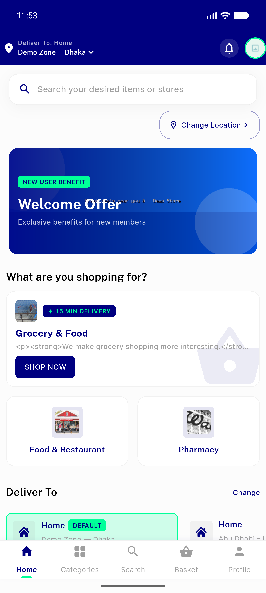
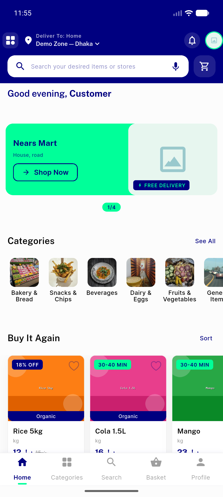
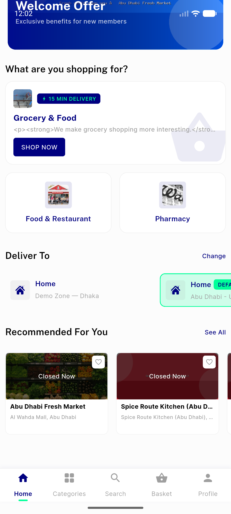
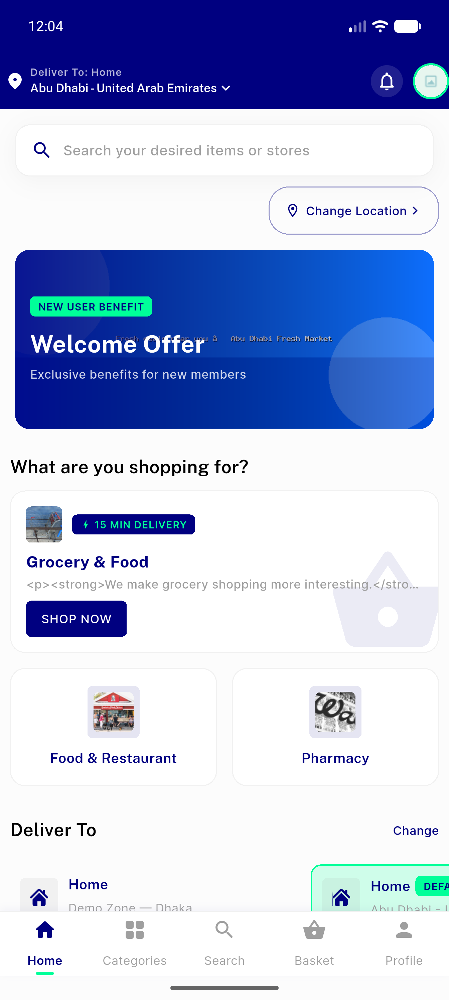
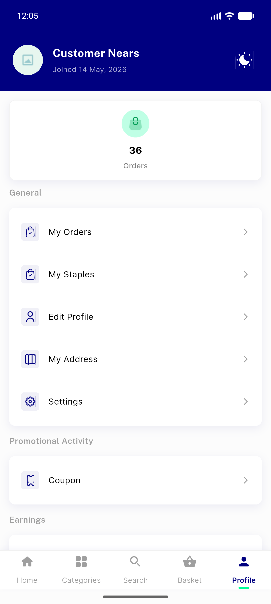
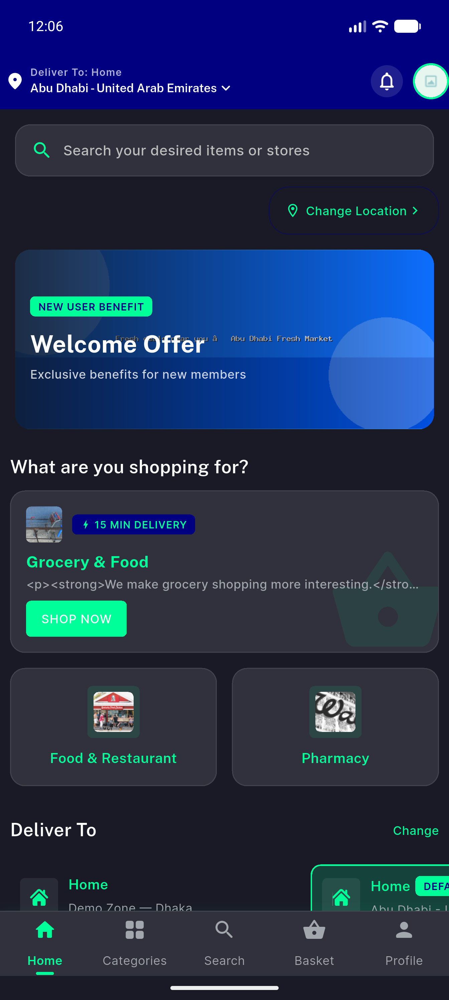
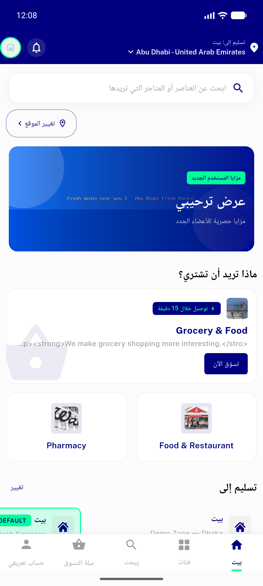
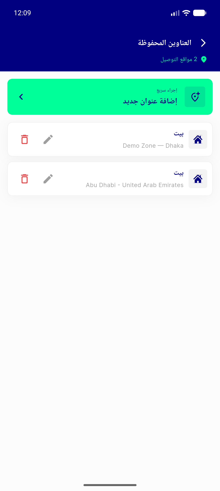

# QA Evidence — NEARS-306

**PASS — Home Landing premium redesign verified live (light/dark/RTL), 4 analytics events fired PII-safe, 89 tests green**

**8 screenshot(s).** Click any thumbnail for full resolution.

<table>
<tr>
<td align="center" width="33%"> landing light</td>
<td align="center" width="33%"> landing hero</td>
<td align="center" width="33%"> landing rail</td>
</tr>
<tr>
<td align="center" width="33%"> header</td>
<td align="center" width="33%"> profile for theme</td>
<td align="center" width="33%"> landing dark</td>
</tr>
<tr>
<td align="center" width="33%"> landing arabic rtl</td>
<td align="center" width="33%"> my address regression</td>
</tr>
</table>

---
*From `nears/docs/qa-evidence/NEARS-306/` · public-repo scrub policy (no live secrets; verified clean).*
