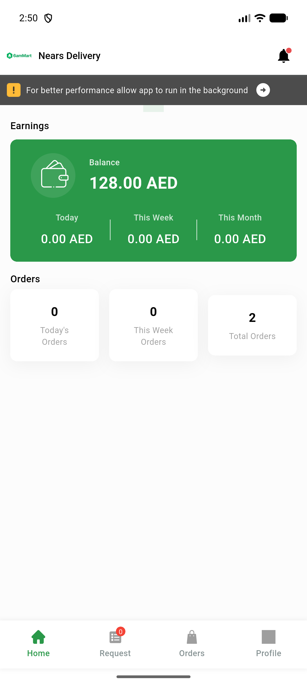
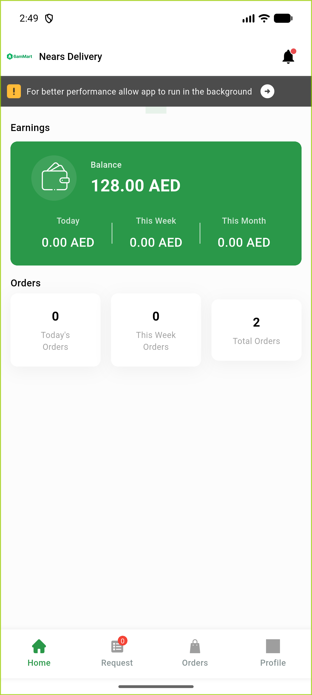
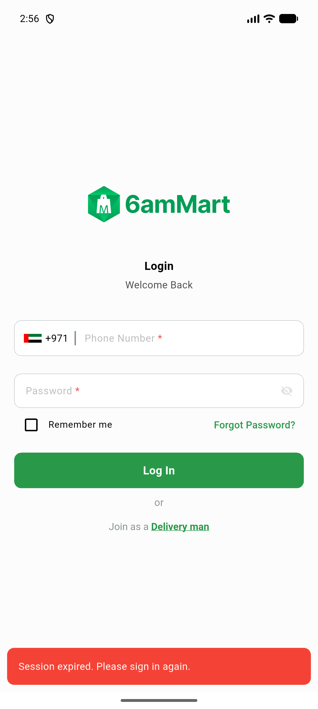

# QA Evidence — NEARS-3063

**PASS — DeliveryApp splash screen->transport layering refactor (NEARS-3063): AC1/AC2 code-shape confirmed live; AC3 corrupt-token cold-start regression guard (NEARS-1448) demonstrated intact via SplashController getter — no crash, one-shot toast fires, consume-once holds, PII-safe [FAIL] log.**

**3 screenshot(s).** Click any thumbnail for full resolution.

<table>
<tr>
<td align="center" width="33%"> ac3 1 coldstart valid session dashboard</td>
<td align="center" width="33%"> ac3 1 dashboard logged in</td>
<td align="center" width="33%"> ac3 2 corrupt token toast</td>
</tr>
</table>

---
*From `nears/docs/qa-evidence/NEARS-3063/` · public-repo scrub policy (no live secrets; verified clean).*
