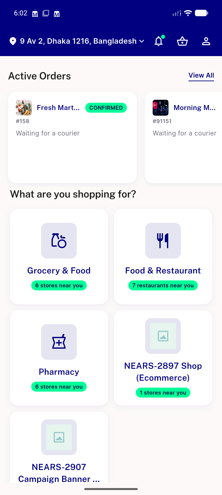
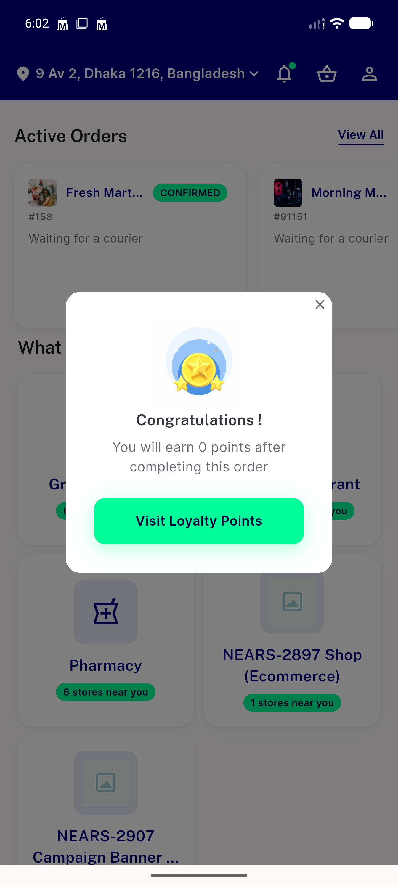

# QA Evidence — NEARS-3065

**PASS — address flow + order-cancel/refund/COD flows live-verified, AC1 regex 0/0, all 227 flutter tests pass**

**2 screenshot(s).** Click any thumbnail for full resolution.

<table>
<tr>
<td align="center" width="33%"> home after refund</td>
<td align="center" width="33%"> refund success home redirect</td>
</tr>
</table>

### Other artifacts
- [`ac1-regex-check.txt`](ac1-regex-check.txt)

---
*From `nears/docs/qa-evidence/NEARS-3065/` · public-repo scrub policy (no live secrets; verified clean).*
