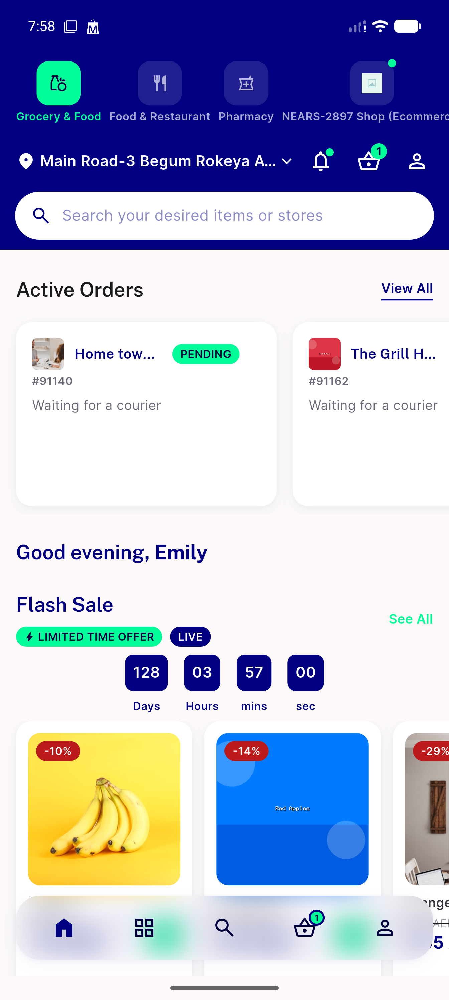

# QA Evidence — NEARS-3066

**PASS - domain-layer Get.find refactor verified live (Home banner/category/brand rails, Favourites add/remove, business registration free-trial shared-pref writes confirmed via live SharedPreferences dump), 1 pre-existing unrelated test failure noted**

**1 screenshot(s).** Click any thumbnail for full resolution.

<table>
<tr>
<td align="center" width="33%"> home grocery loaded</td>
</tr>
</table>

### Other artifacts
- [`bug-payment-screen-noop-order-service-typeerror.log`](bug-payment-screen-noop-order-service-typeerror.log)

---
*From `nears/docs/qa-evidence/NEARS-3066/` · public-repo scrub policy (no live secrets; verified clean).*
