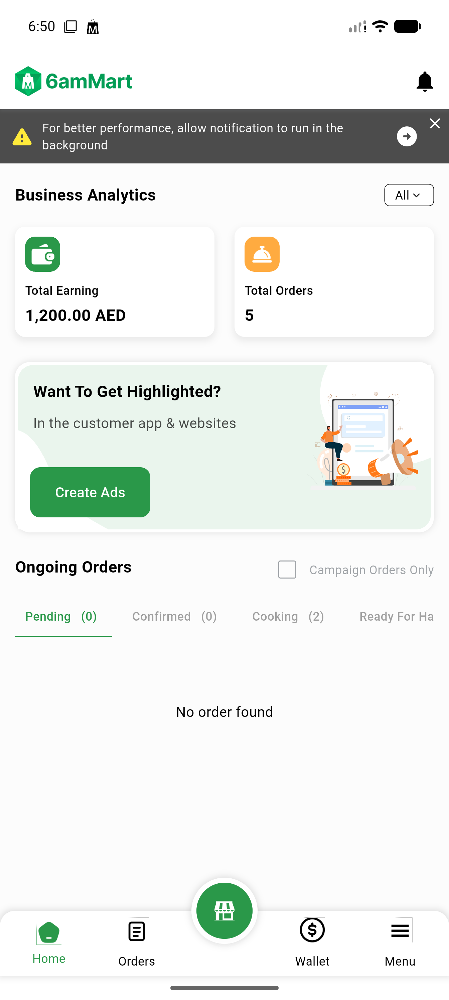
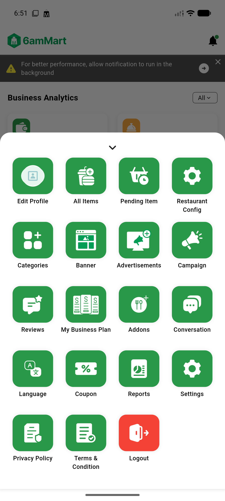
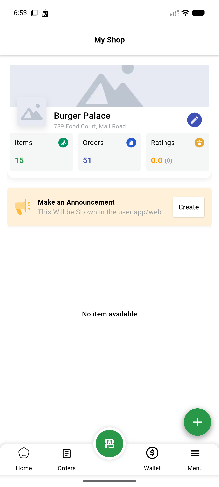
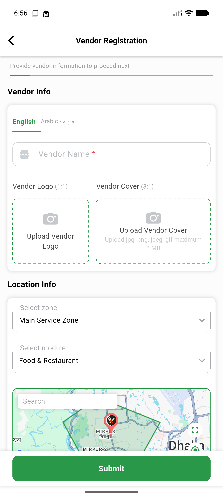
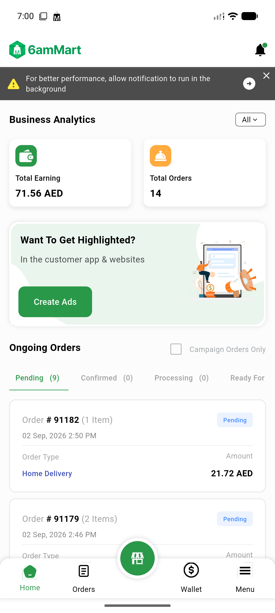
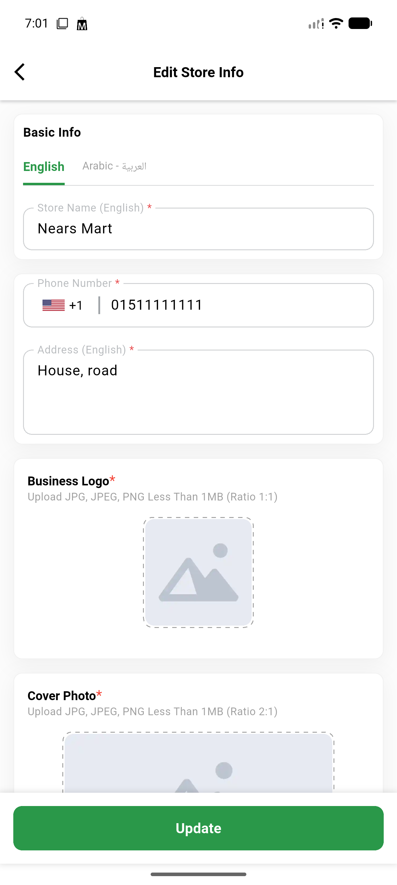

# QA Evidence — NEARS-3067

**PASS - all 6 ACs demonstrated live, flutter analyze 8/8 baseline match, release build succeeded, 330/330 tests pass**

**6 screenshot(s).** Click any thumbnail for full resolution.

<table>
<tr>
<td align="center" width="33%"> initial</td>
<td align="center" width="33%"> menu sheet</td>
<td align="center" width="33%"> store screen</td>
</tr>
<tr>
<td align="center" width="33%"> registration upload icons</td>
<td align="center" width="33%"> cold start dashboard</td>
<td align="center" width="33%"> store edit upload</td>
</tr>
</table>

### Other artifacts
- [`bug-itemmodel-int-string-typeerror.log`](bug-itemmodel-int-string-typeerror.log)
- [`bug-subscriptiontransaction-int-string-typeerror.log`](bug-subscriptiontransaction-int-string-typeerror.log)
- [`bug-zone-lookup-404-registration.log`](bug-zone-lookup-404-registration.log)

---
*From `nears/docs/qa-evidence/NEARS-3067/` · public-repo scrub policy (no live secrets; verified clean).*
