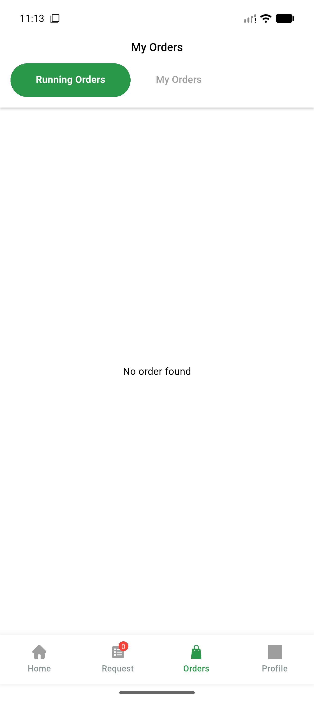
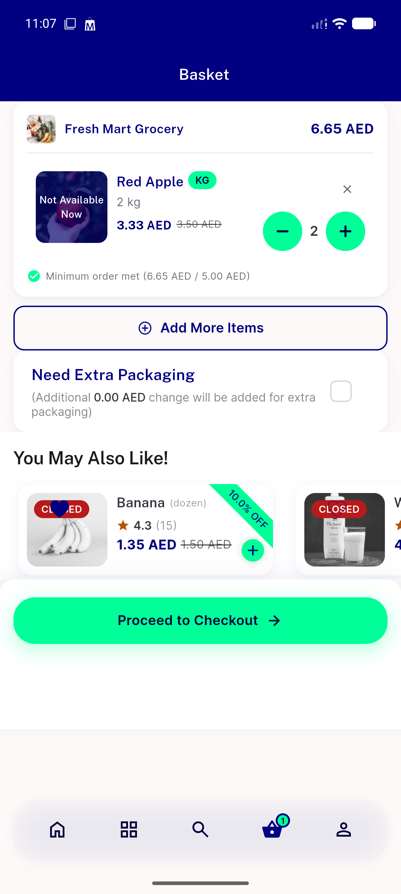
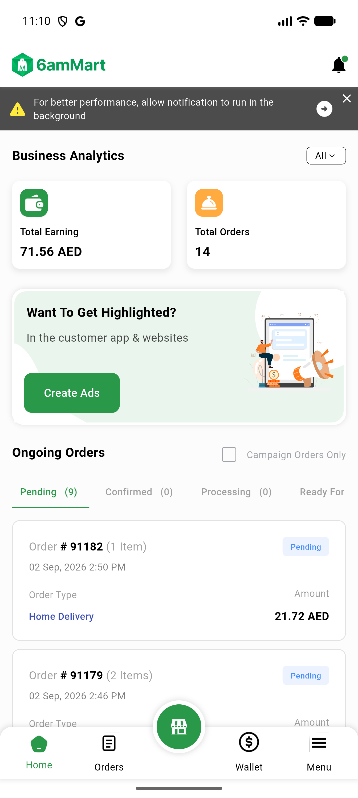

# QA Evidence — NEARS-3075

**PASS — dead-code cleanup verified across UserApp/VendorApp/DeliveryApp**

**3 screenshot(s).** Click any thumbnail for full resolution.

<table>
<tr>
<td align="center" width="33%"> ac6 deliveryapp orders</td>
<td align="center" width="33%"> ac6 userapp cart</td>
<td align="center" width="33%"> ac6 vendorapp dashboard</td>
</tr>
</table>

---
*From `nears/docs/qa-evidence/NEARS-3075/` · public-repo scrub policy (no live secrets; verified clean).*
