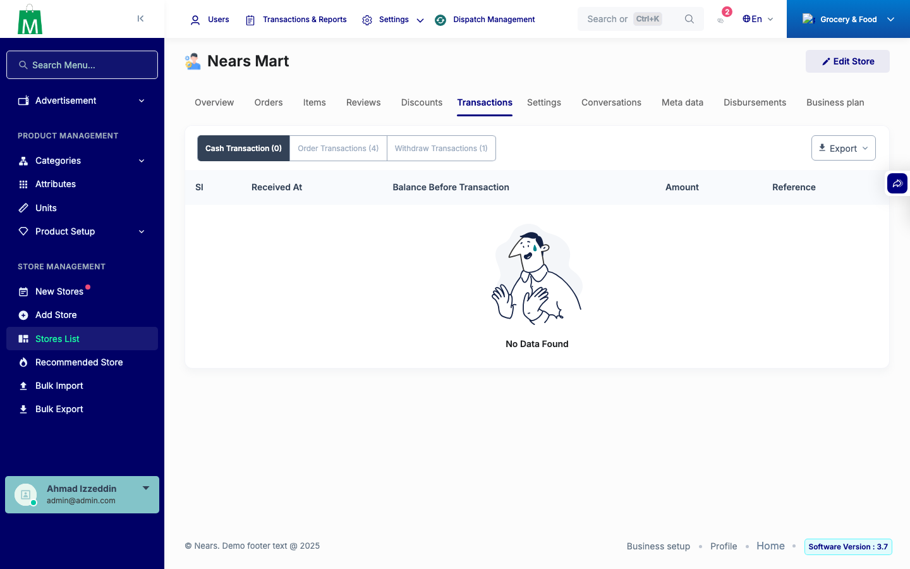
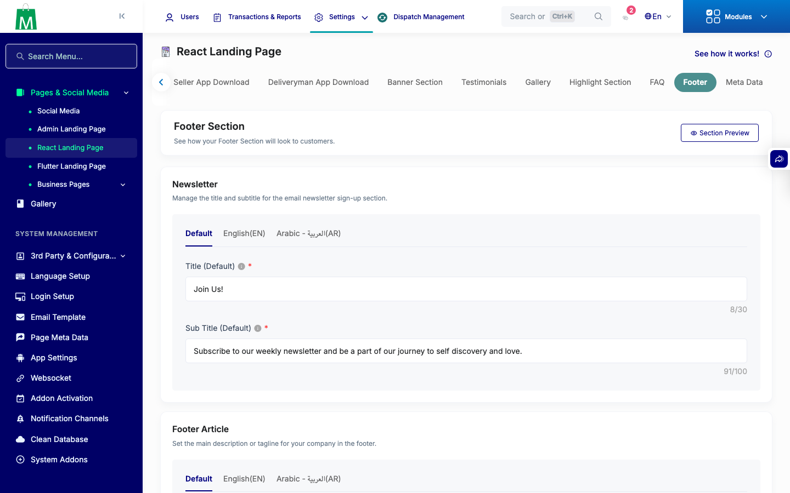
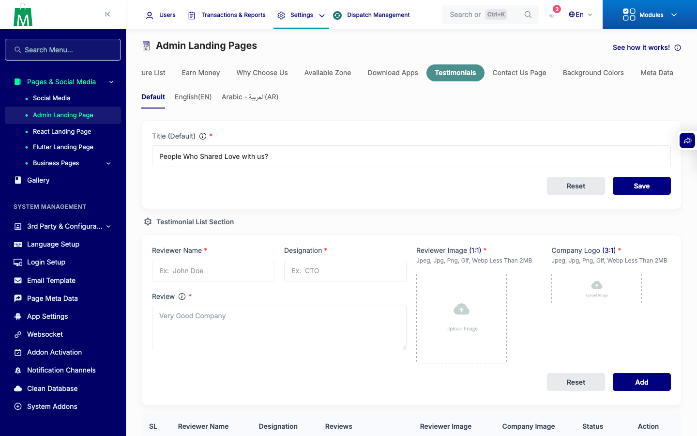

# QA Evidence — NEARS-3077

**PASS - all deleted views gone, all 9 kept views render clean, scanner backstop clean (15 residual, none of the 9 kept)**

**3 screenshot(s).** Click any thumbnail for full resolution.

<table>
<tr>
<td align="center" width="33%"> ac1 vendor transaction cash</td>
<td align="center" width="33%"> ac2 kept react footer</td>
<td align="center" width="33%"> ac2 kept testimonials</td>
</tr>
</table>

### Other artifacts
- [`ac3-scanner-residual.log`](ac3-scanner-residual.log)

---
*From `nears/docs/qa-evidence/NEARS-3077/` · public-repo scrub policy (no live secrets; verified clean).*
