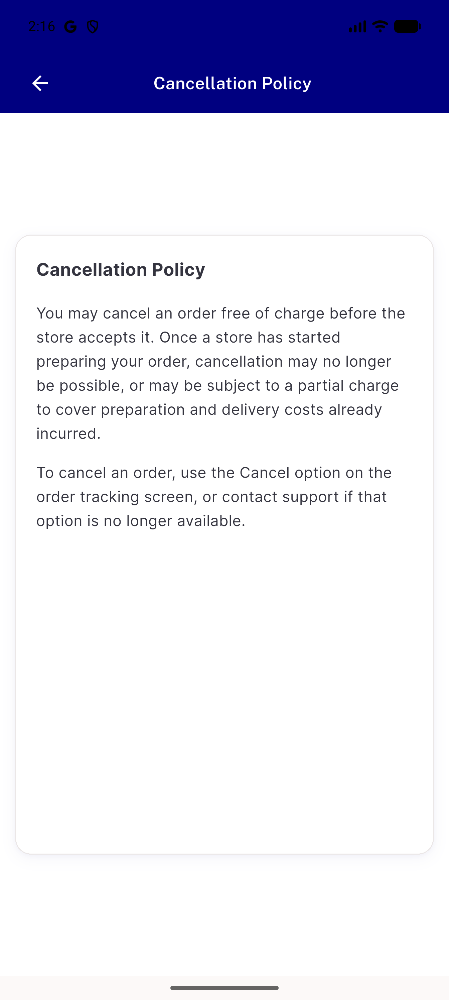
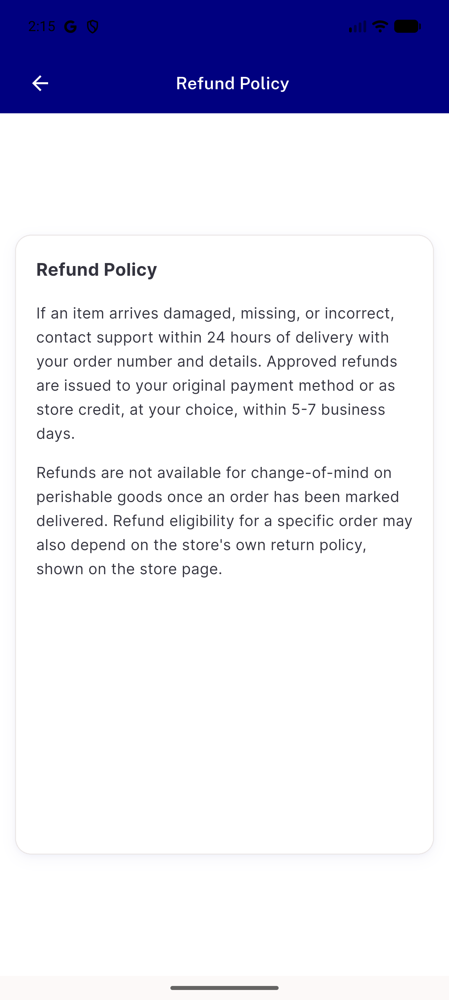
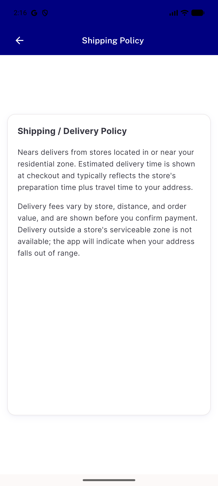
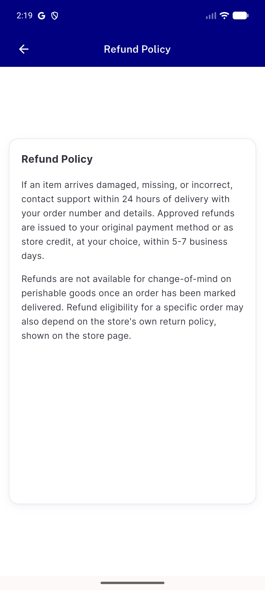
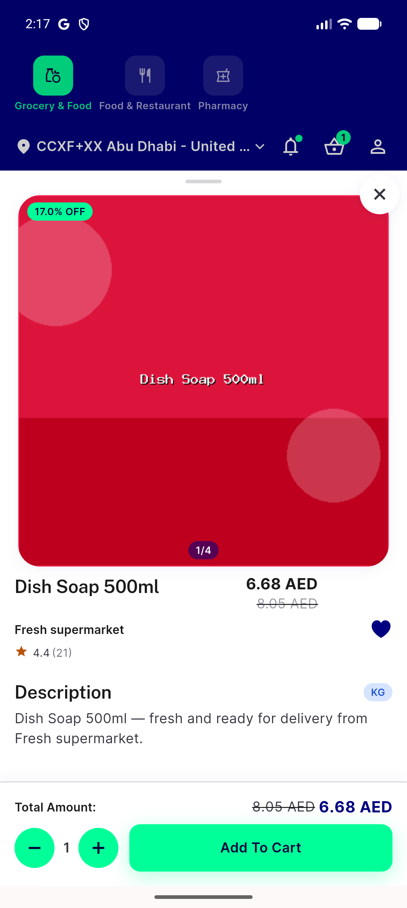
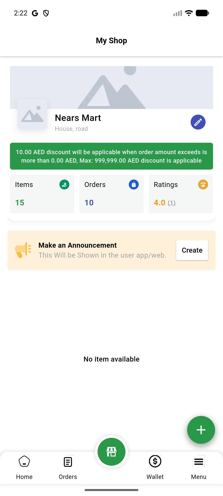
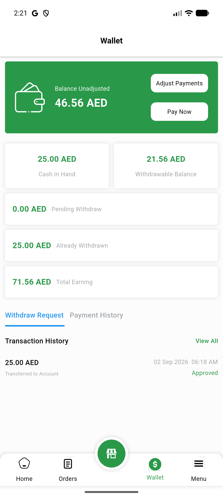
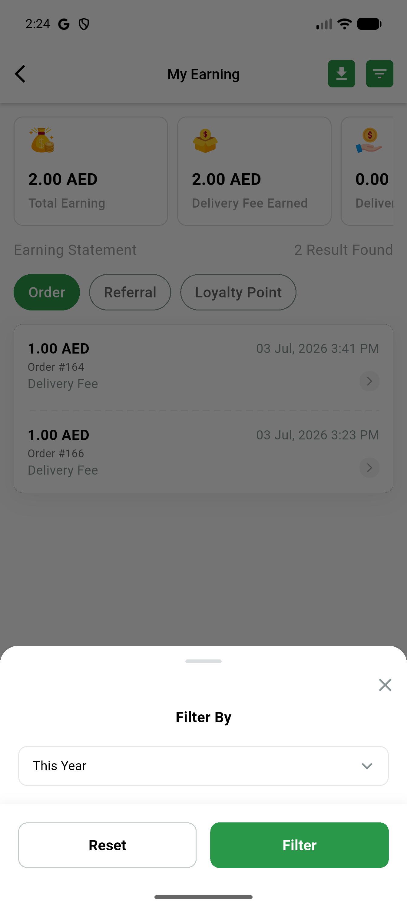

# QA Evidence — NEARS-3090

**PASS - dead route/endpoint deletion verified live on UserApp/VendorApp/DeliveryApp, all retained routes render correctly; 2 unrelated pre-existing regression bugs found and flagged (not blocking)**

**8 screenshot(s).** Click any thumbnail for full resolution.

<table>
<tr>
<td align="center" width="33%"> ac2 cancellation policy</td>
<td align="center" width="33%"> ac2 refund policy</td>
<td align="center" width="33%"> ac2 shipping policy</td>
</tr>
<tr>
<td align="center" width="33%"> ac3 checkout refund link</td>
<td align="center" width="33%"> ac4 item details</td>
<td align="center" width="33%"> ac5 vendor store</td>
</tr>
<tr>
<td align="center" width="33%"> ac5 vendor wallet</td>
<td align="center" width="33%"> ac6 delivery earning filter</td>
</tr>
</table>

### Other artifacts
- [`bug-userapp-payment-screen-error-retry-mock-typeerror.log`](bug-userapp-payment-screen-error-retry-mock-typeerror.log)
- [`bug-vendorapp-itemmodel-fromjson-typeerror.log`](bug-vendorapp-itemmodel-fromjson-typeerror.log)

---
*From `nears/docs/qa-evidence/NEARS-3090/` · public-repo scrub policy (no live secrets; verified clean).*
