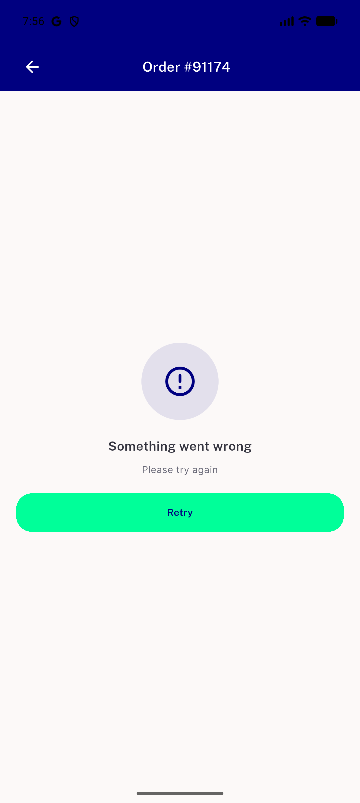

# QA Evidence — NEARS-3091

**PASS - UserApp/VendorApp/DeliveryApp all boot cleanly, all in-scope moved-file surfaces verified live; 2 pre-existing regression_bugs found (unrelated backend order/details 500 + order-details error-state Back-button stuck)**

**1 screenshot(s).** Click any thumbnail for full resolution.

<table>
<tr>
<td align="center" width="33%"> bug reorder order details 500 stuck back</td>
</tr>
</table>

### Other artifacts
- [`bug-reorder-order-details-500-stuck-back.log`](bug-reorder-order-details-500-stuck-back.log)

---
*From `nears/docs/qa-evidence/NEARS-3091/` · public-repo scrub policy (no live secrets; verified clean).*
