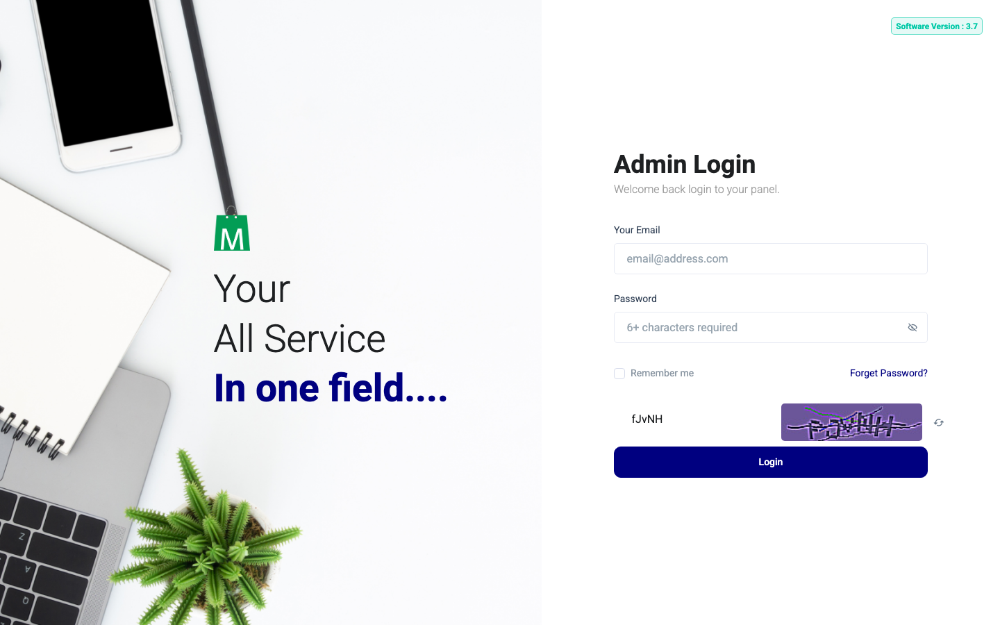

# QA Evidence — NEARS-3102

**PASS - notification.php dead-file removal + favicon.ico fix, QA-lite**

**1 screenshot(s).** Click any thumbnail for full resolution.

<table>
<tr>
<td align="center" width="33%"> ac2 login favicon</td>
</tr>
</table>

---
*From `nears/docs/qa-evidence/NEARS-3102/` · public-repo scrub policy (no live secrets; verified clean).*
