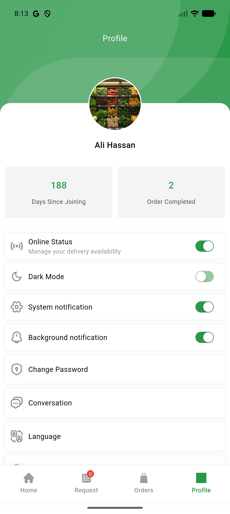

# QA Evidence — NEARS-3106

**PASS — config-driven Pusher key wired for UserApp+DeliveryApp; live /api/v1/config serves websocket_key unconditionally; protocol-level handshake proof with positive/negative controls; both apps boot clean with the pre-existing (unrelated) websocket_status gate skipping gracefully in this env**

**2 screenshot(s).** Click any thumbnail for full resolution.

<table>
<tr>
<td align="center" width="33%"> deliveryapp online status</td>
<td align="center" width="33%"> userapp order tracking</td>
</tr>
</table>

### Other artifacts
- [`ac3-config-body.json`](ac3-config-body.json)
- [`ac3-config-headers.txt`](ac3-config-headers.txt)
- [`ws-handshake-proof.log`](ws-handshake-proof.log)

---
*From `nears/docs/qa-evidence/NEARS-3106/` · public-repo scrub policy (no live secrets; verified clean).*
