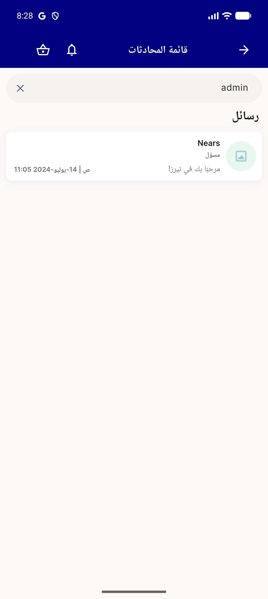
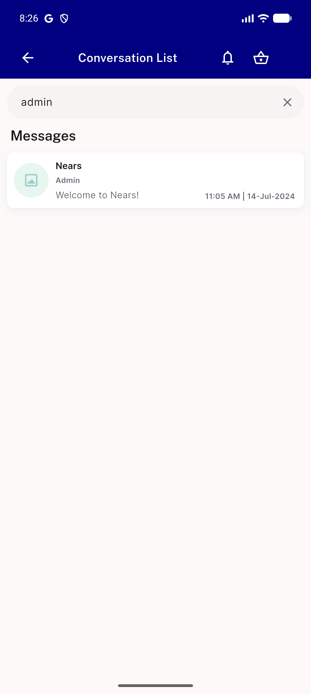
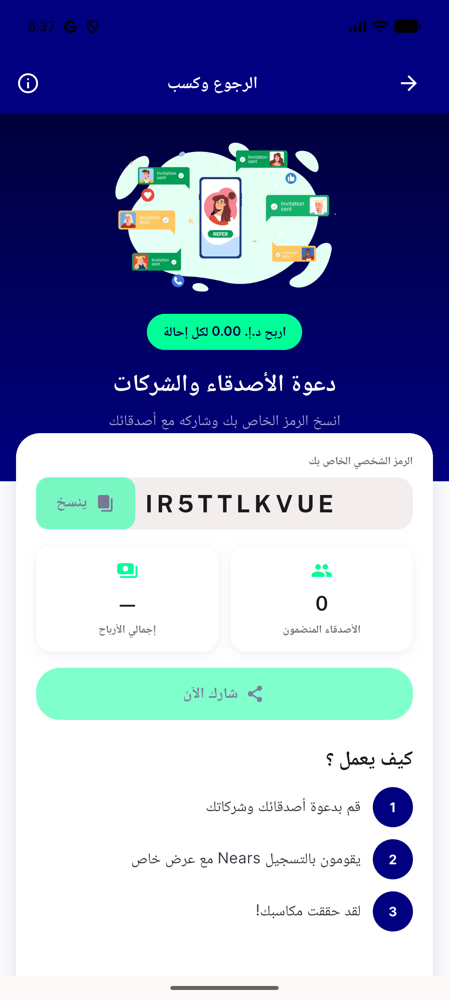

# QA Evidence — NEARS-3107

**PASS — vendor-string purge (chat greeting, 500 mailto, config fallback, refer&earn gating) verified live, EN+AR**

**4 screenshot(s).** Click any thumbnail for full resolution.

<table>
<tr>
<td align="center" width="33%"> ac1 chat welcome ar rtl</td>
<td align="center" width="33%"> ac1 chat welcome en</td>
<td align="center" width="33%"> ac4 refer earn disabled ar</td>
</tr>
<tr>
<td align="center" width="33%"> ac4 refer earn share enabled ar</td>
</tr>
</table>

### Other artifacts
- [`ac4-refer-earn-disabled-dump.xml`](ac4-refer-earn-disabled-dump.xml)

---
*From `nears/docs/qa-evidence/NEARS-3107/` · public-repo scrub policy (no live secrets; verified clean).*
