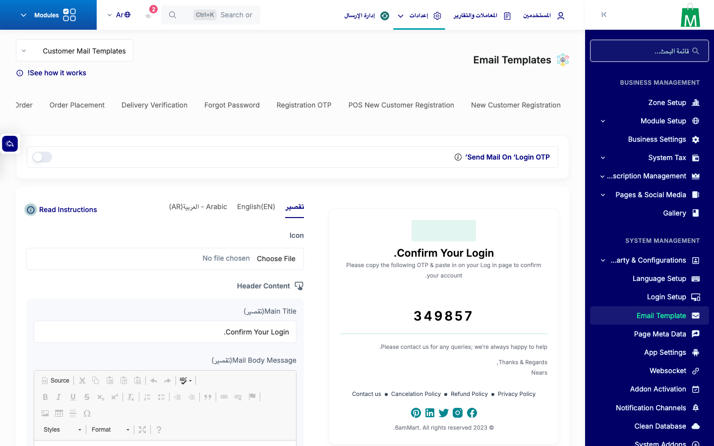
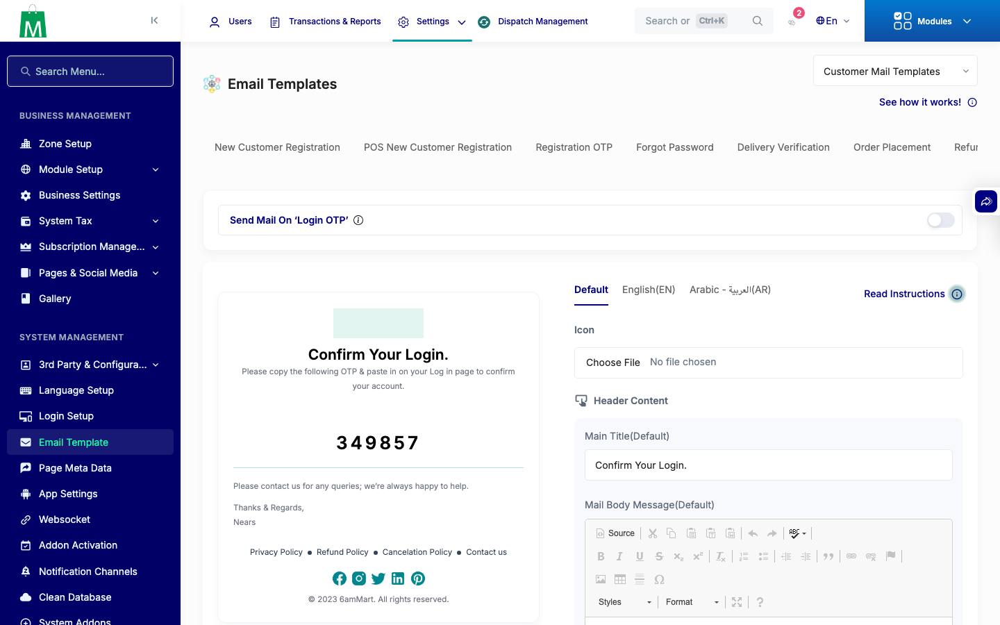
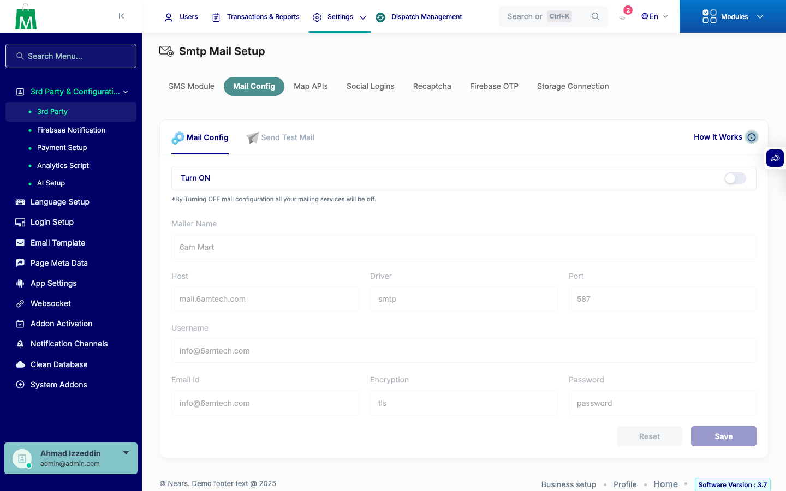
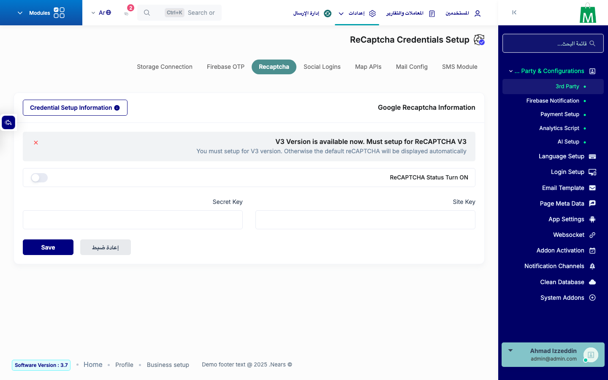
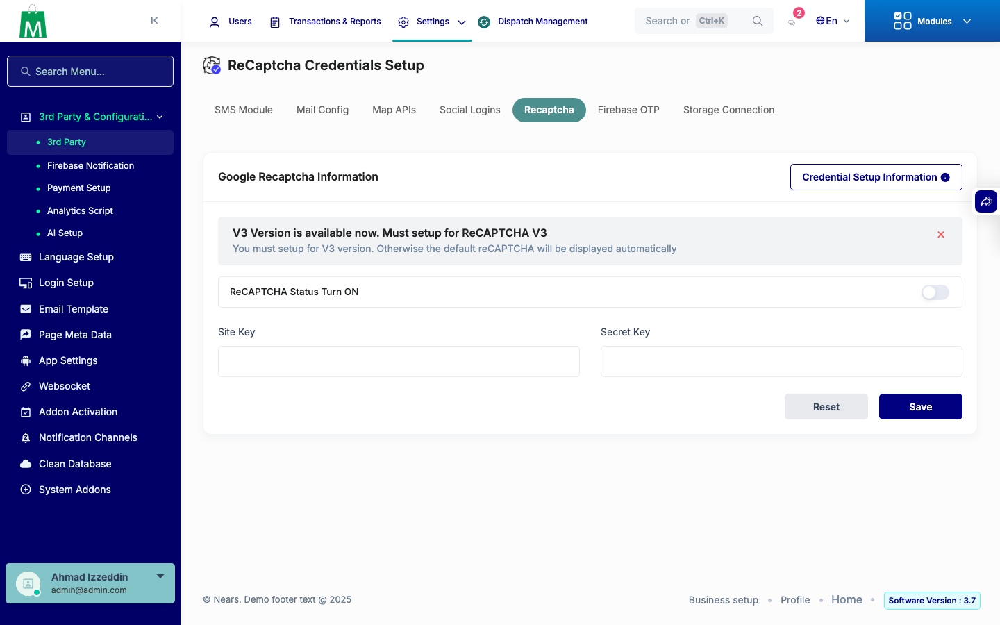

# QA Evidence — NEARS-3108

**PASS - AC1+AC2 verified live (en+ar), self-heal never reintroduced old-brand key text**

**5 screenshot(s).** Click any thumbnail for full resolution.

<table>
<tr>
<td align="center" width="33%"> ac1 login otp format ar</td>
<td align="center" width="33%"> ac1 login otp format en</td>
<td align="center" width="33%"> ac2 mail index en</td>
</tr>
<tr>
<td align="center" width="33%"> ac2 recaptcha index ar</td>
<td align="center" width="33%"> ac2 recaptcha index en</td>
</tr>
</table>

---
*From `nears/docs/qa-evidence/NEARS-3108/` · public-repo scrub policy (no live secrets; verified clean).*
