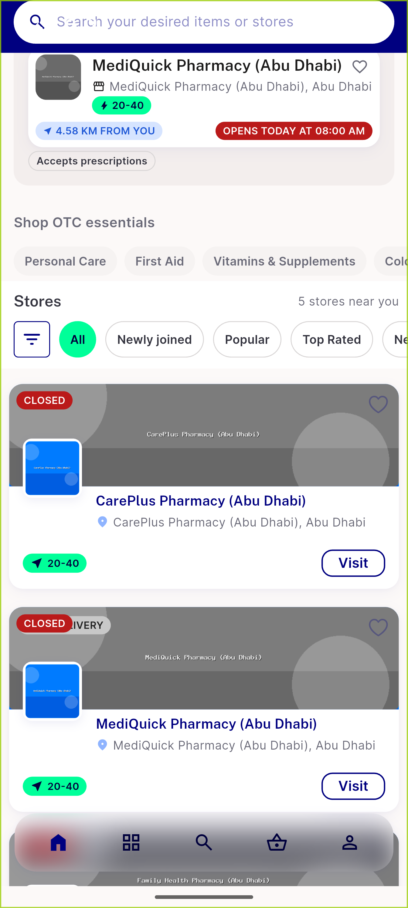
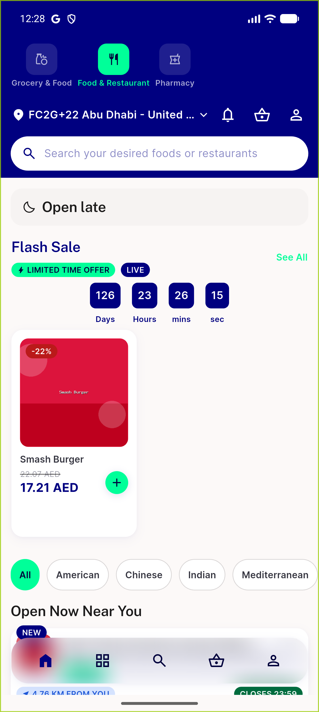
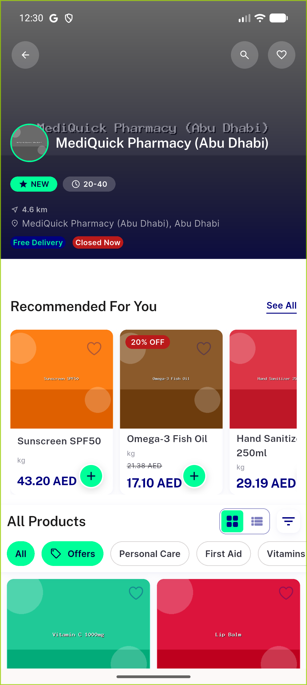

# QA Evidence — NEARS-3113

**PASS — StoreController clock seam, test-only diff, byte-identical production behavior, live device sweep clean**

**4 screenshot(s).** Click any thumbnail for full resolution.

<table>
<tr>
<td align="center" width="33%"> all stores pharmacy</td>
<td align="center" width="33%"> food home</td>
<td align="center" width="33%"> pharmacy home</td>
</tr>
<tr>
<td align="center" width="33%"> store profile</td>
</tr>
</table>

### Other artifacts
- [`ac1-full-suite-comparison.log`](ac1-full-suite-comparison.log)
- [`ac2-clock-seam-mutation-verified.log`](ac2-clock-seam-mutation-verified.log)
- [`ac5-regression-candidates.log`](ac5-regression-candidates.log)
- [`bug-payment-screen-error-retry-null-outcome.log`](bug-payment-screen-error-retry-null-outcome.log)

---
*From `nears/docs/qa-evidence/NEARS-3113/` · public-repo scrub policy (no live secrets; verified clean).*
