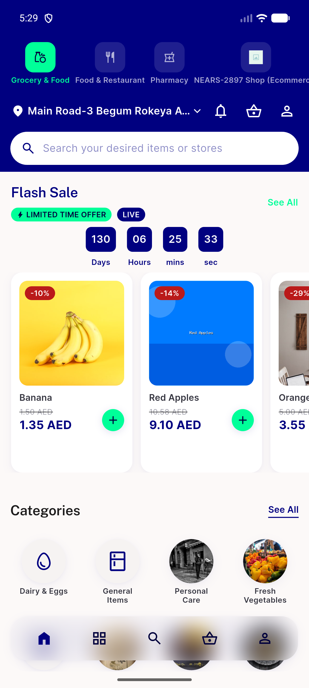
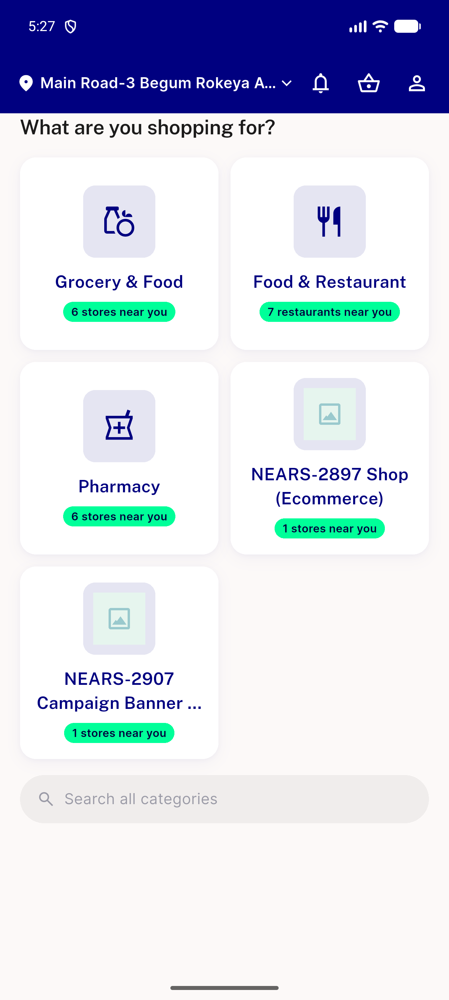
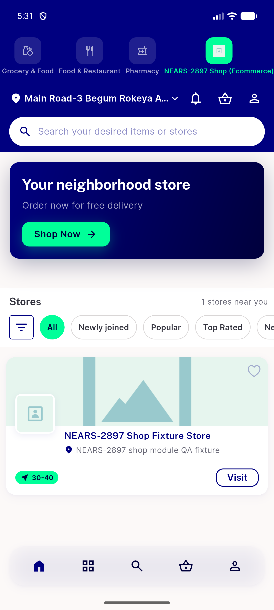

# QA Evidence — NEARS-3117

**PASS — baseline seeds from network-confirmed pass only; no false New badges; positive control + tap-clear both verified live**

**4 screenshot(s).** Click any thumbnail for full resolution.

<table>
<tr>
<td align="center" width="33%"> ac1 post relaunch no false new</td>
<td align="center" width="33%"> ac2 module switcher row organic</td>
<td align="center" width="33%"> ac2 organic new badges home</td>
</tr>
<tr>
<td align="center" width="33%"> ac3 dot cleared after tap</td>
</tr>
</table>

---
*From `nears/docs/qa-evidence/NEARS-3117/` · public-repo scrub policy (no live secrets; verified clean).*
