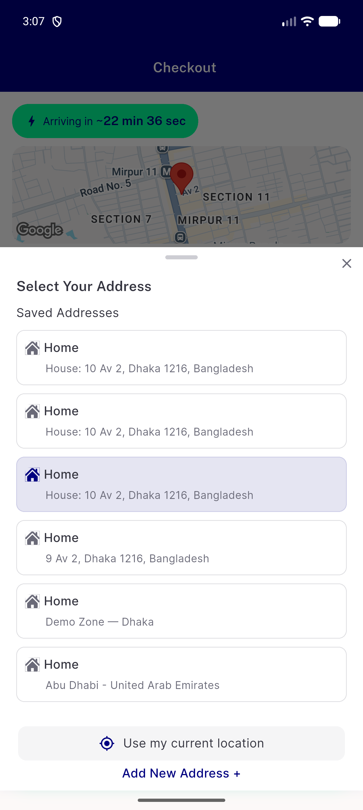

# QA Evidence — NEARS-3118

**PASS — checkout delivery-address bottom sheet renders exactly ONE drag handle after showHandle:false fix (d0eff191a)**

**1 screenshot(s).** Click any thumbnail for full resolution.

<table>
<tr>
<td align="center" width="33%"> address sheet single handle</td>
</tr>
</table>

---
*From `nears/docs/qa-evidence/NEARS-3118/` · public-repo scrub policy (no live secrets; verified clean).*
