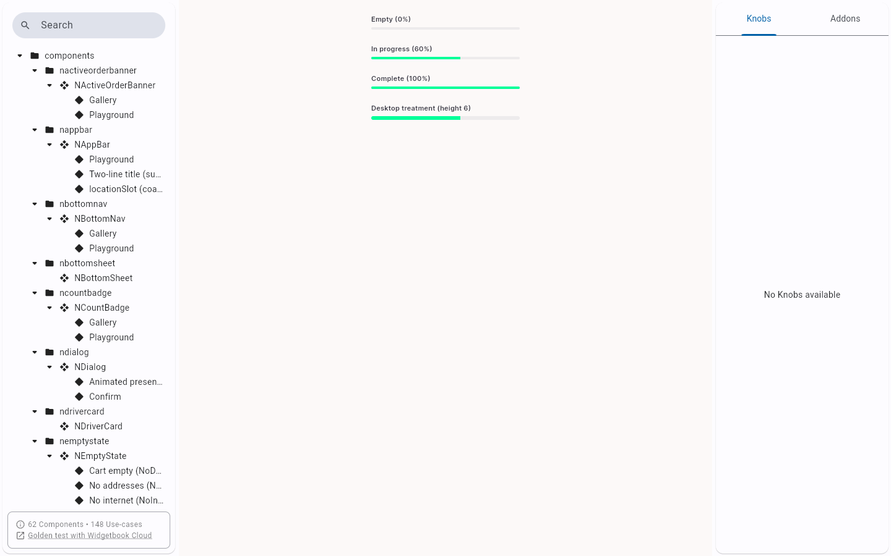

# QA Evidence — NEARS-3119

**PASS - NLinearProgress DLS element live-verified via Widgetbook web (light mode)**

**1 screenshot(s).** Click any thumbnail for full resolution.

<table>
<tr>
<td align="center" width="33%"> ac2 bounded loose host</td>
</tr>
</table>

---
*From `nears/docs/qa-evidence/NEARS-3119/` · public-repo scrub policy (no live secrets; verified clean).*
