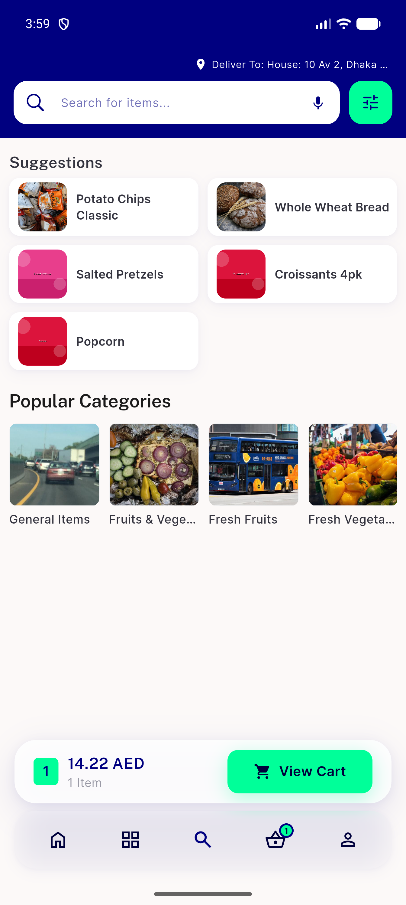
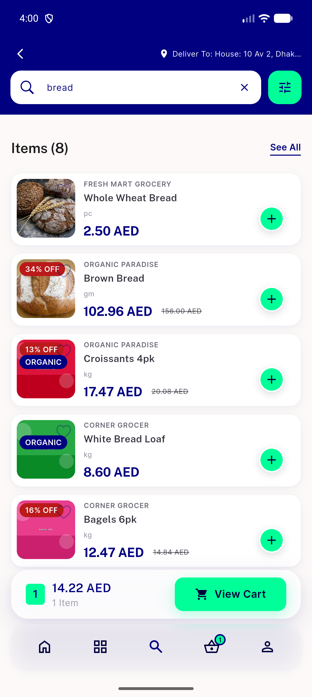
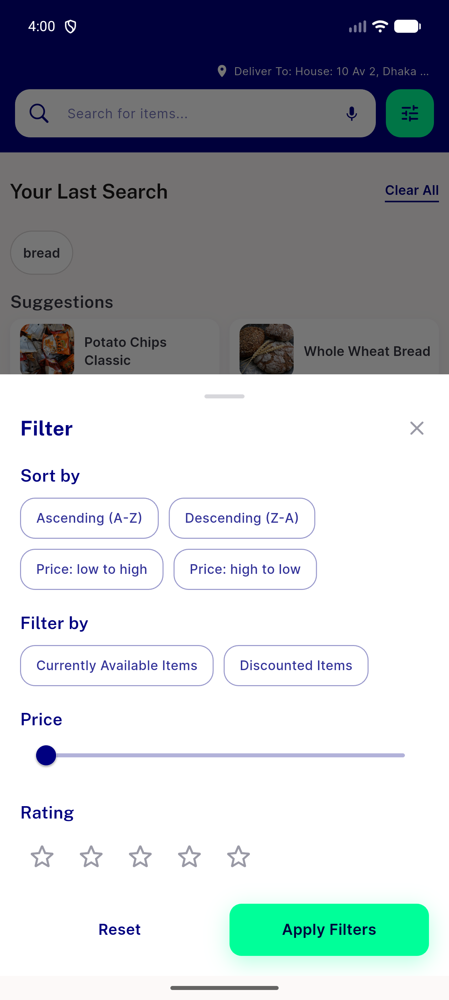
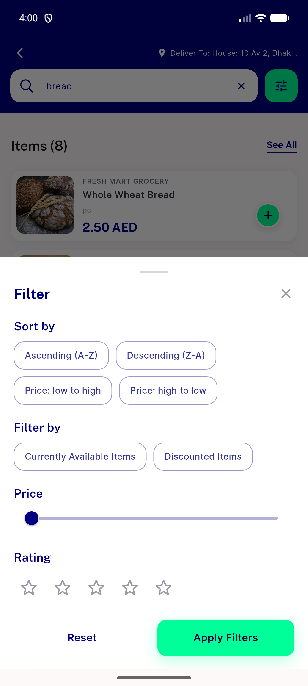

# QA Evidence — NEARS-3120

**PASS -- premise-falsification confirmed live; AC1-3 device-verified idle+results+tap, AC4 test hardening green (6/6)**

**4 screenshot(s).** Click any thumbnail for full resolution.

<table>
<tr>
<td align="center" width="33%"> ac1 idle header</td>
<td align="center" width="33%"> ac2 results header</td>
<td align="center" width="33%"> ac3 filter sheet idle</td>
</tr>
<tr>
<td align="center" width="33%"> ac3 filter sheet results</td>
</tr>
</table>

---
*From `nears/docs/qa-evidence/NEARS-3120/` · public-repo scrub policy (no live secrets; verified clean).*
