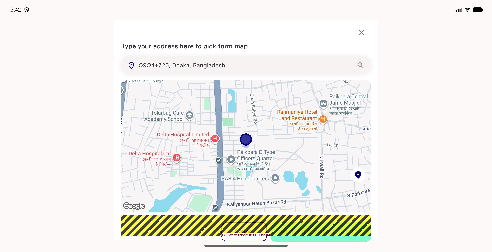
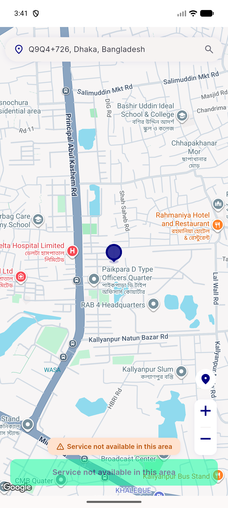

# QA Evidence — NEARS-3121

**PASS -- AC1 current-location FAB content-desc verified live (mobile+desktop branches), 27/27 automated backstop green**

**2 screenshot(s).** Click any thumbnail for full resolution.

<table>
<tr>
<td align="center" width="33%"> ac1 pickmapscreen desktop fab</td>
<td align="center" width="33%"> ac1 pickmapscreen fab</td>
</tr>
</table>

### Other artifacts
- [`ac1-pickmapscreen-desktop-dump.xml`](ac1-pickmapscreen-desktop-dump.xml)
- [`ac1-pickmapscreen-dump.xml`](ac1-pickmapscreen-dump.xml)
- [`bug-pickmap-desktop-renderflex-overflow.log`](bug-pickmap-desktop-renderflex-overflow.log)

---
*From `nears/docs/qa-evidence/NEARS-3121/` · public-repo scrub policy (no live secrets; verified clean).*
