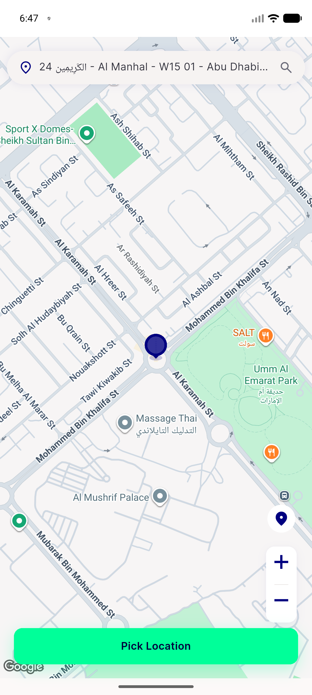

# QA Evidence — NEARS-3129

**FAIL — AC1 race condition: slower drag zone-check leapfrogs FAB's token, drag address overwrites FAB's**

**1 screenshot(s).** Click any thumbnail for full resolution.

<table>
<tr>
<td align="center" width="33%"> bug ac1 drag wins race</td>
</tr>
</table>

### Other artifacts
- [`bug-ac1-drag-wins-race.log`](bug-ac1-drag-wins-race.log)

---
*From `nears/docs/qa-evidence/NEARS-3129/` · public-repo scrub policy (no live secrets; verified clean).*
