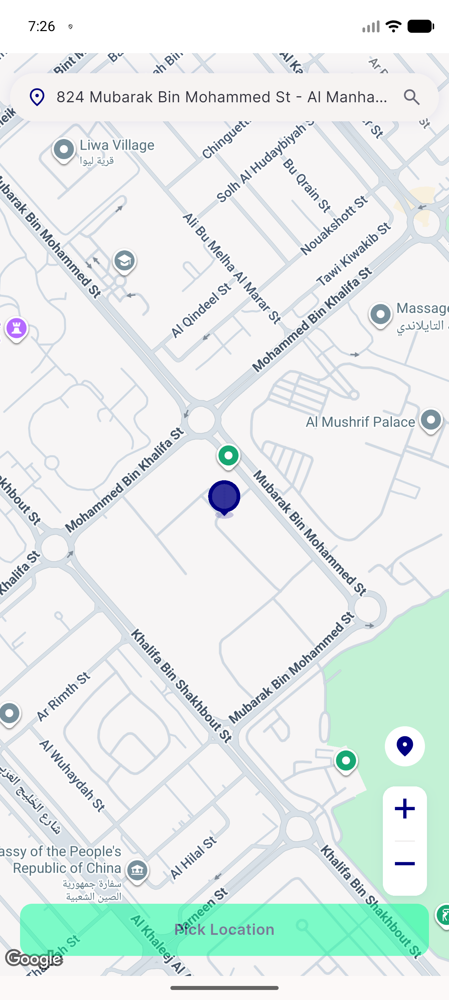
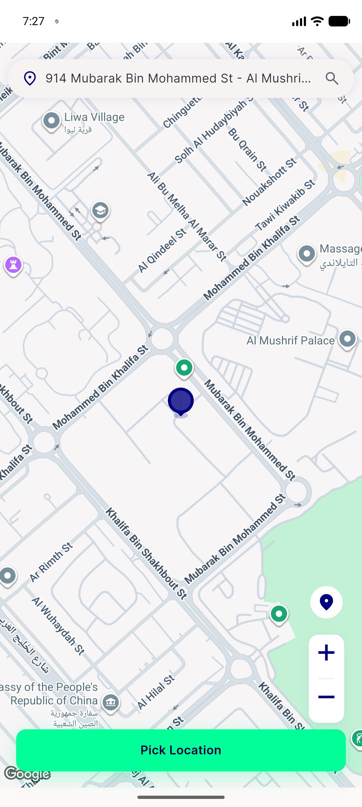

# QA Evidence — NEARS-3130

**PASS — pick_map_screen loading gate now waits for BOTH zone+geocode (emulator-5562)**

**2 screenshot(s).** Click any thumbnail for full resolution.

<table>
<tr>
<td align="center" width="33%"> ac1 ac3 midpoint disabled</td>
<td align="center" width="33%"> ac2 final enabled</td>
</tr>
</table>

### Other artifacts
- [`ac1-ac3-midpoint-dump.xml`](ac1-ac3-midpoint-dump.xml)
- [`ac2-final-dump.xml`](ac2-final-dump.xml)

---
*From `nears/docs/qa-evidence/NEARS-3130/` · public-repo scrub policy (no live secrets; verified clean).*
