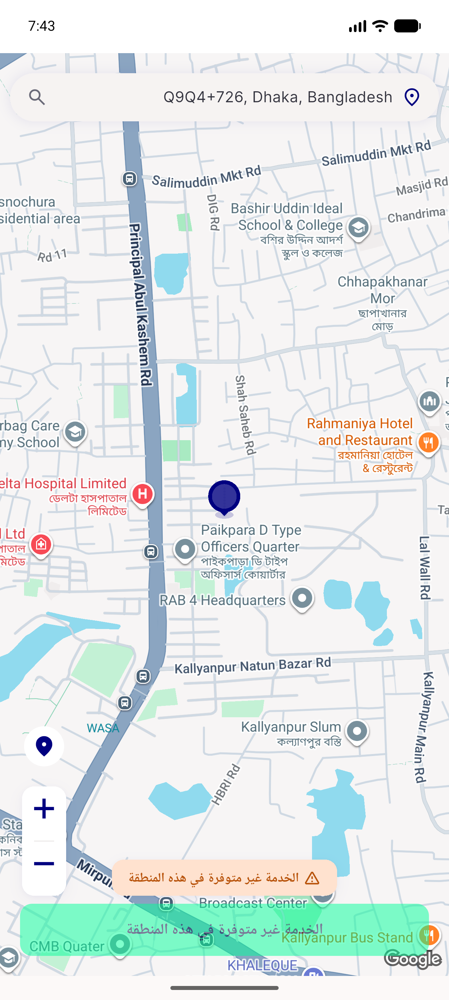
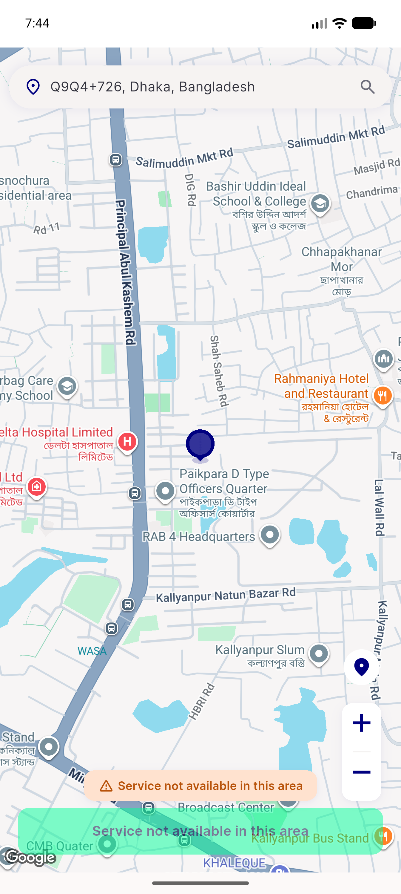

# QA Evidence — NEARS-3131

**PASS — pick_map zoom in/out semantic labels localized (ar/en verified)**

**2 screenshot(s).** Click any thumbnail for full resolution.

<table>
<tr>
<td align="center" width="33%"> qa 3131 ar zoom labels</td>
<td align="center" width="33%"> qa 3131 en zoom labels</td>
</tr>
</table>

### Other artifacts
- [`qa-3131-ar-dump.xml`](qa-3131-ar-dump.xml)
- [`qa-3131-en-dump.xml`](qa-3131-en-dump.xml)

---
*From `nears/docs/qa-evidence/NEARS-3131/` · public-repo scrub policy (no live secrets; verified clean).*
