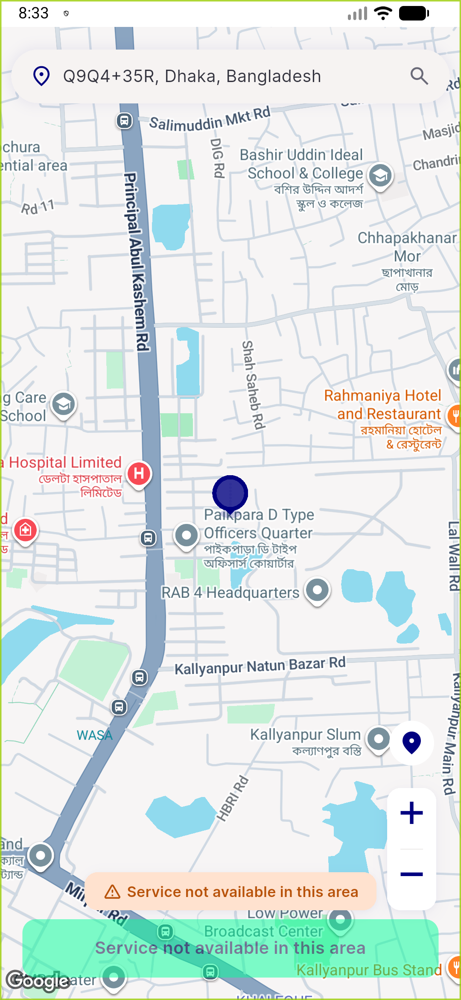
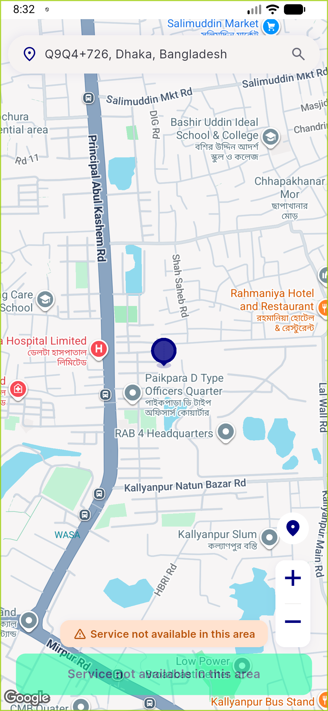
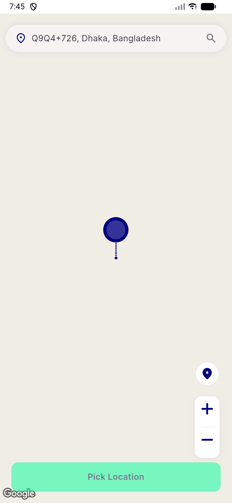
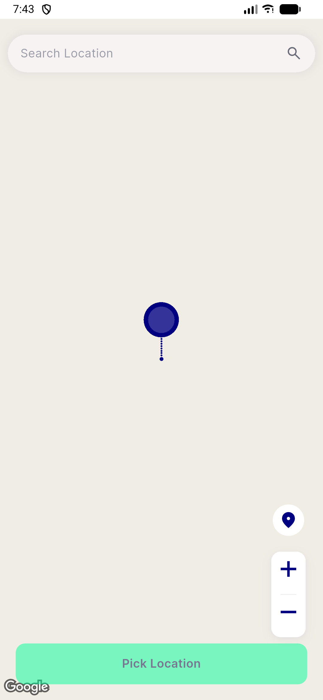

# QA Evidence — NEARS-3132

**FIX-CYCLE 2 (final) delta re-QA: AC1 PASS -- onCameraIdle fires reliably (4 geocode/zone NET pairs per pan round x2 rounds), zero Maps API-token errors, proxy fix independently re-verified. AC2/AC3 unchanged PASS.**

**4 screenshot(s).** Click any thumbnail for full resolution.

<table>
<tr>
<td align="center" width="33%"> ac1 cycle2 map after pan</td>
<td align="center" width="33%"> ac1 cycle2 map before pan</td>
<td align="center" width="33%"> ac1 map after swipe still blank</td>
</tr>
<tr>
<td align="center" width="33%"> ac1 map before check</td>
</tr>
</table>

### Other artifacts
- [`ac1-blocked-device-contention.log`](ac1-blocked-device-contention.log)
- [`ac1-cycle2-PASS.log`](ac1-cycle2-PASS.log)
- [`ac2-df-reclaim.log`](ac2-df-reclaim.log)
- [`bug-ac1-oncameraidle-still-not-firing.log`](bug-ac1-oncameraidle-still-not-firing.log)

---
*From `nears/docs/qa-evidence/NEARS-3132/` · public-repo scrub policy (no live secrets; verified clean).*
