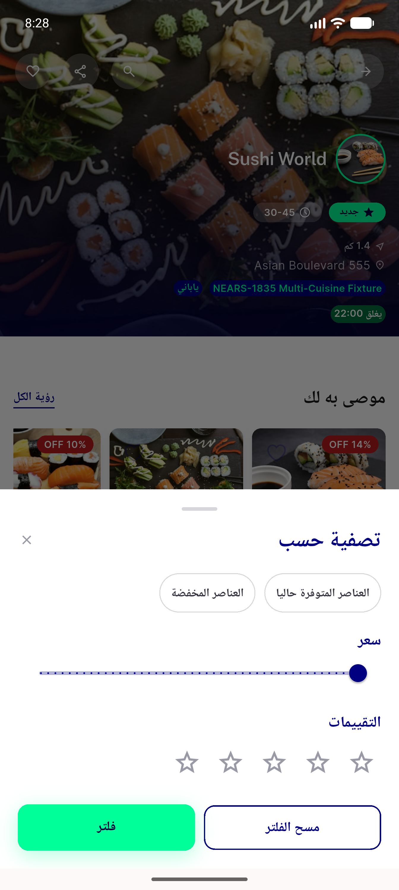
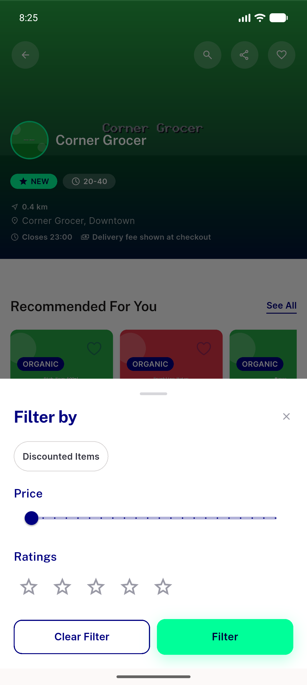
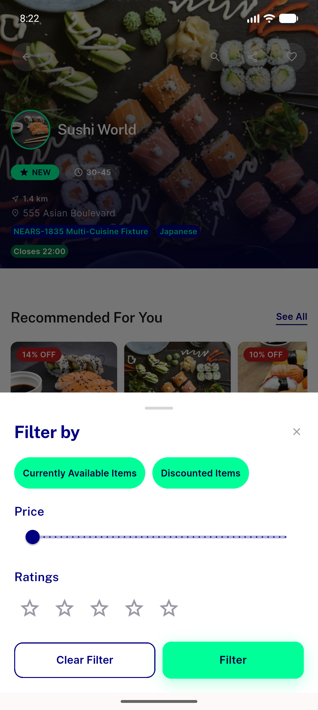
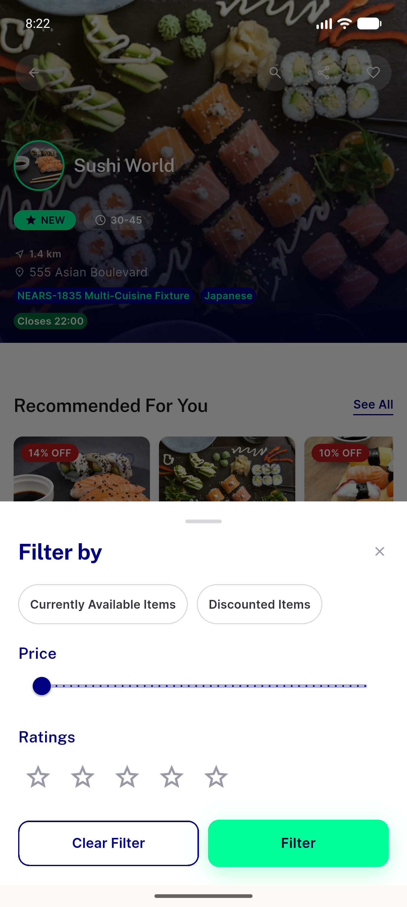
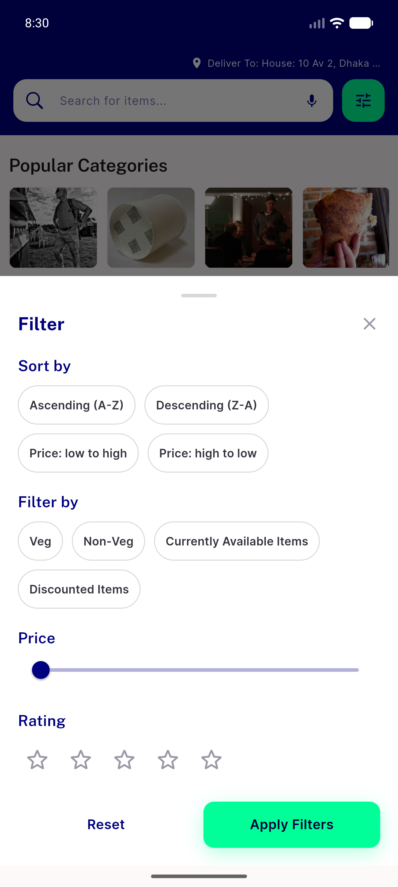

# QA Evidence — NEARS-3137

**PASS - NFilterChip migration in store filter Dialog+BottomSheet, light mode, all ACs demonstrated live**

**5 screenshot(s).** Click any thumbnail for full resolution.

<table>
<tr>
<td align="center" width="33%"> ac rtl store filter arabic</td>
<td align="center" width="33%"> ac1 nonfood store no availability chip</td>
<td align="center" width="33%"> ac2 ac3 store filter selected</td>
</tr>
<tr>
<td align="center" width="33%"> ac2 ac3 store filter unselected</td>
<td align="center" width="33%"> ac4 search module nfilterchip reference</td>
</tr>
</table>

### Other artifacts
- [`ac3-a11y-dump-selected.xml`](ac3-a11y-dump-selected.xml)
- [`ac3-a11y-dump-unselected.xml`](ac3-a11y-dump-unselected.xml)

---
*From `nears/docs/qa-evidence/NEARS-3137/` · public-repo scrub policy (no live secrets; verified clean).*
