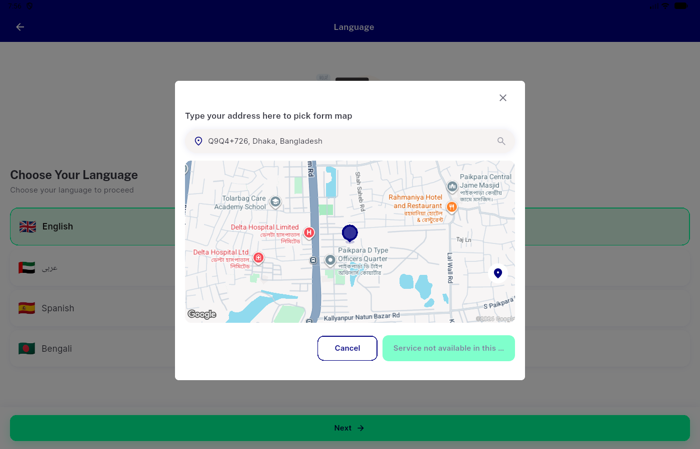
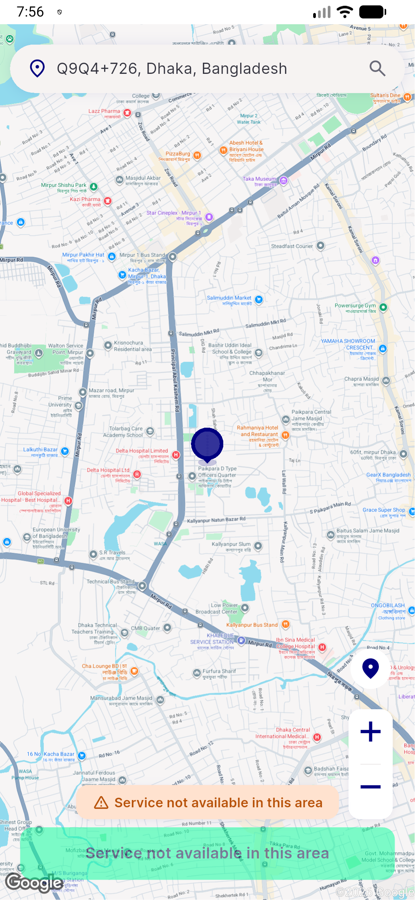

# QA Evidence — NEARS-3138

**PASS - pick_map_screen desktop overflow fix verified, zero RenderFlex overflow at 1400x900, mobile branch unaffected**

**2 screenshot(s).** Click any thumbnail for full resolution.

<table>
<tr>
<td align="center" width="33%"> desktop 1400x900 pickmap</td>
<td align="center" width="33%"> mobile pickmap</td>
</tr>
</table>

---
*From `nears/docs/qa-evidence/NEARS-3138/` · public-repo scrub policy (no live secrets; verified clean).*
