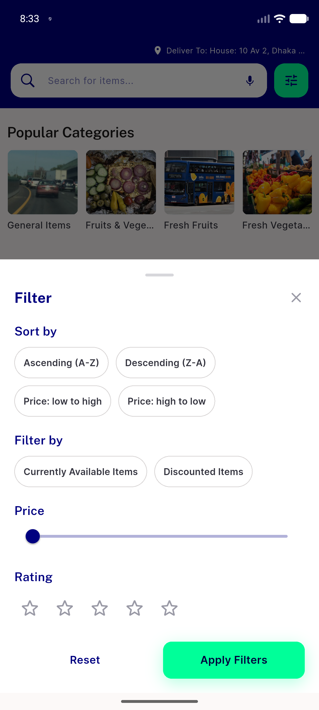
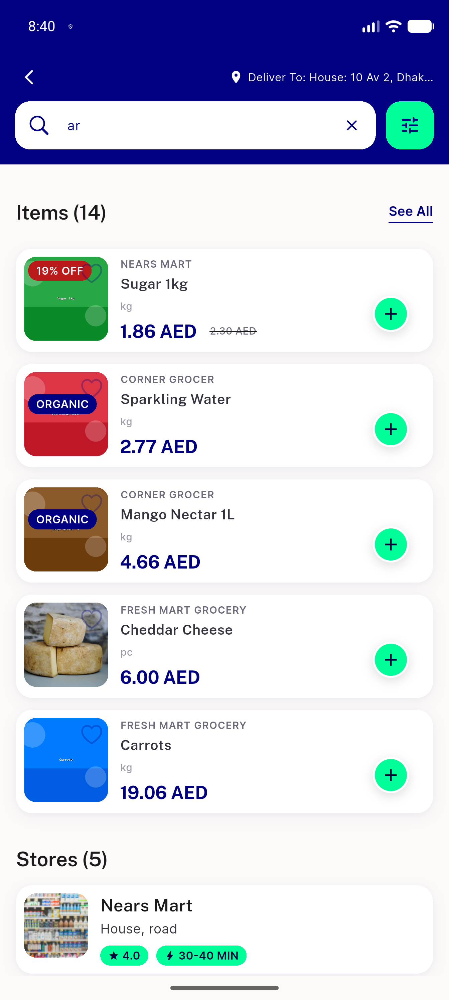
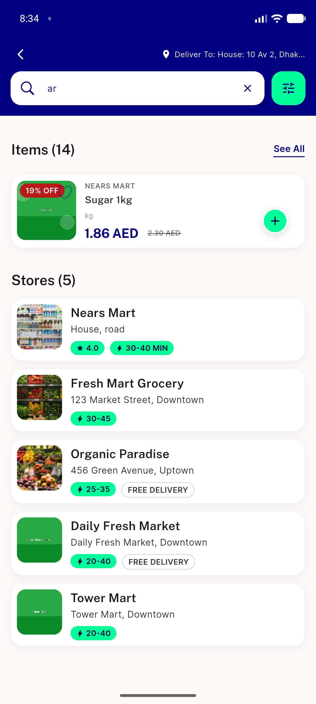

# QA Evidence — NEARS-3139

**PASS - dead-code removal (isStore/setStore) verified live on emulator-5562; item-search filter sheet + results page unaffected; sortStoreSearchList no-op args confirmed identity-transform**

**3 screenshot(s).** Click any thumbnail for full resolution.

<table>
<tr>
<td align="center" width="33%"> idle filter sheet</td>
<td align="center" width="33%"> results filter applied</td>
<td align="center" width="33%"> results page</td>
</tr>
</table>

### Other artifacts
- [`results-page-stores5-dump.xml`](results-page-stores5-dump.xml)

---
*From `nears/docs/qa-evidence/NEARS-3139/` · public-repo scrub policy (no live secrets; verified clean).*
