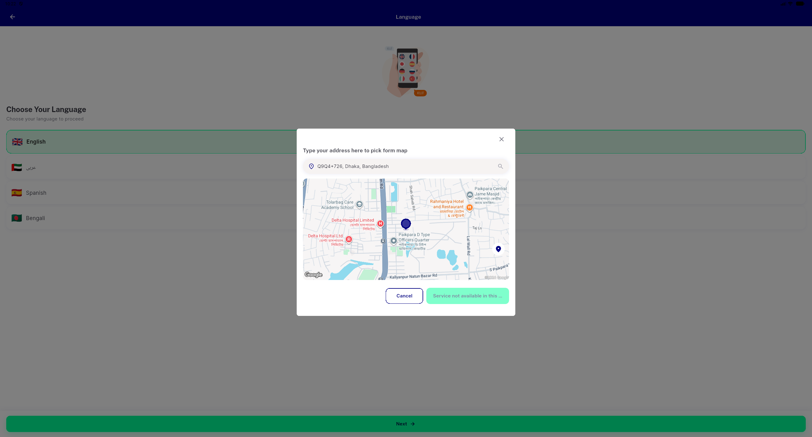

# QA Evidence — NEARS-3198

**PASS (fix-cycle 2) — literal cold-start repro now transitions cleanly, zero prior content**

**2 screenshot(s).** Click any thumbnail for full resolution.

<table>
<tr>
<td align="center" width="33%"> bug ac1 ac2 coldstart dialog over language chooser</td>
<td align="center" width="33%"> pass cycle2 ac1 ac2 coldstart real transition</td>
</tr>
</table>

---
*From `nears/docs/qa-evidence/NEARS-3198/` · public-repo scrub policy (no live secrets; verified clean).*
