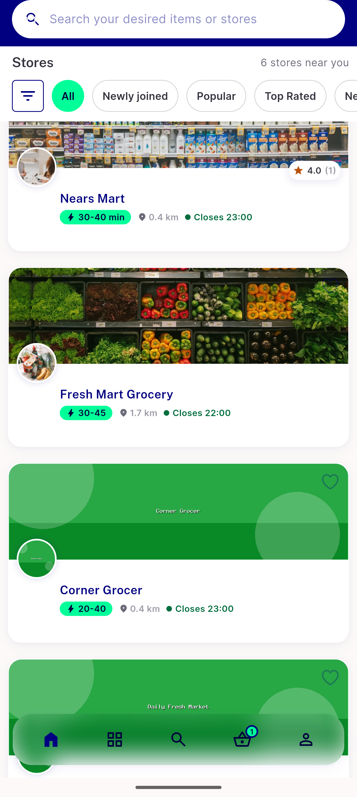
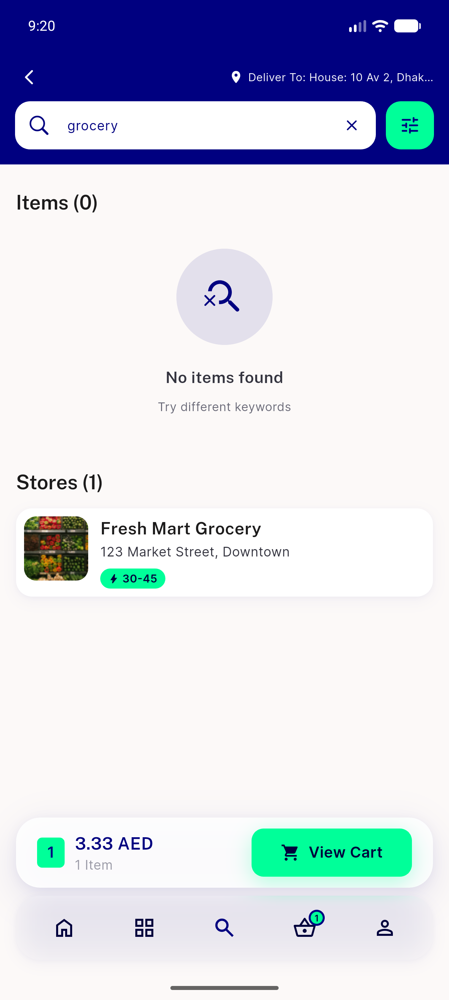

# QA Evidence — NEARS-3199

**PASS -- SearchController.storesTabVisible dead-code removal, AC1-3 verified**

**2 screenshot(s).** Click any thumbnail for full resolution.

<table>
<tr>
<td align="center" width="33%"> ac3 module home stores section</td>
<td align="center" width="33%"> ac3 search results stores section</td>
</tr>
</table>

---
*From `nears/docs/qa-evidence/NEARS-3199/` · public-repo scrub policy (no live secrets; verified clean).*
