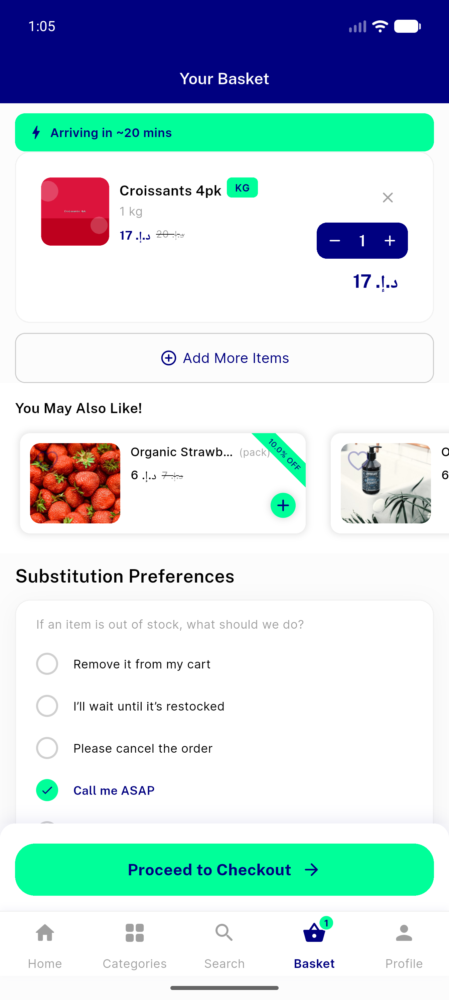
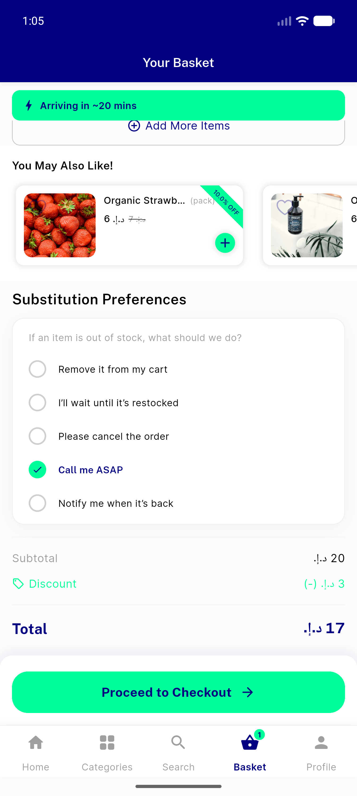
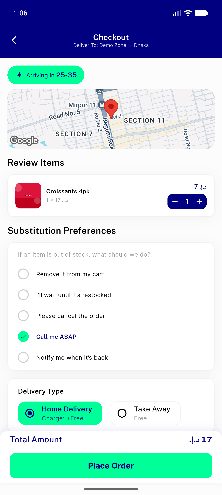
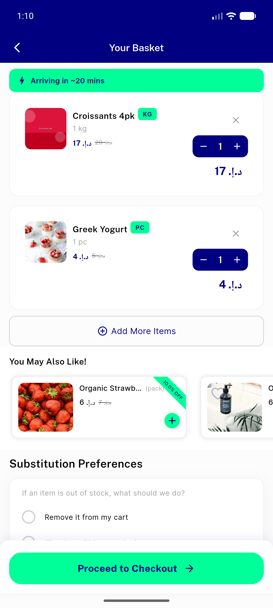
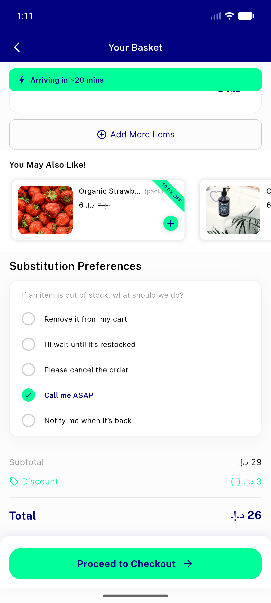

# QA Evidence — NEARS-321

**PASS — cart MVVM refactor byte-identical; re-entry crash fixed**

**7 screenshot(s).** Click any thumbnail for full resolution.

<table>
<tr>
<td align="center" width="33%"> cart single item</td>
<td align="center" width="33%"> order summary</td>
<td align="center" width="33%"> checkout totals</td>
</tr>
<tr>
<td align="center" width="33%"> cart two items</td>
<td align="center" width="33%"> summary two items</td>
<td align="center" width="33%"> reentry cart</td>
</tr>
<tr>
<td align="center" width="33%"> qty update summary</td>
</tr>
</table>

---
*From `nears/docs/qa-evidence/NEARS-321/` · public-repo scrub policy (no live secrets; verified clean).*
