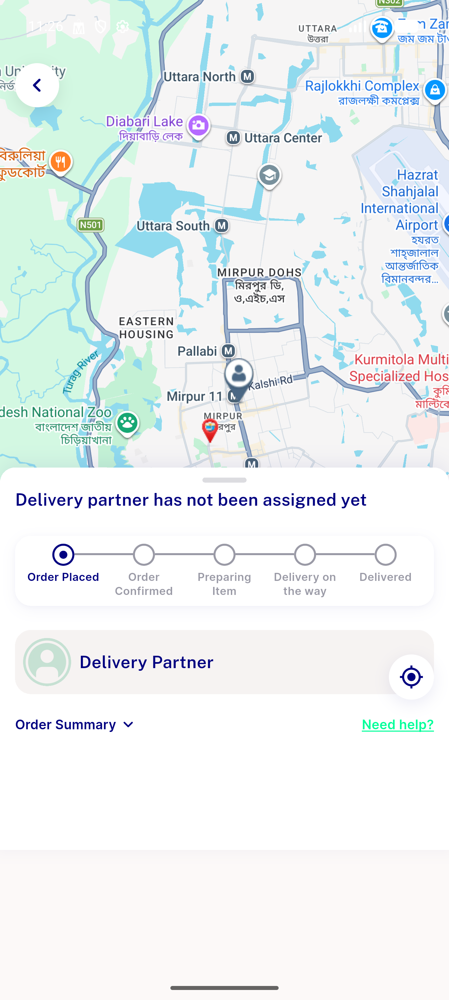
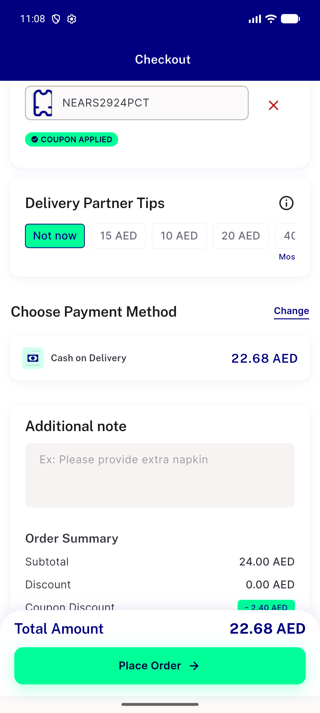

# QA Evidence — NEARS-3218

**PASS — Step 0 shells verified, zero regression on checkout money path (coupon single-subtract + place-order double-submit guard both hold); 1 pre-existing unrelated High regression candidate found (phone country-code default) routed to PO, not blocking**

**2 screenshot(s).** Click any thumbnail for full resolution.

<table>
<tr>
<td align="center" width="33%"> ac3 order confirmed</td>
<td align="center" width="33%"> ac4 coupon applied</td>
</tr>
</table>

### Other artifacts
- [`ac4-coupon-and-double-submit-evidence.log`](ac4-coupon-and-double-submit-evidence.log)
- [`bug-checkout-phone-country-code-defaults-wrong.log`](bug-checkout-phone-country-code-defaults-wrong.log)
- [`bug-order-tracking-geolocator-timeout.log`](bug-order-tracking-geolocator-timeout.log)

---
*From `nears/docs/qa-evidence/NEARS-3218/` · public-repo scrub policy (no live secrets; verified clean).*
